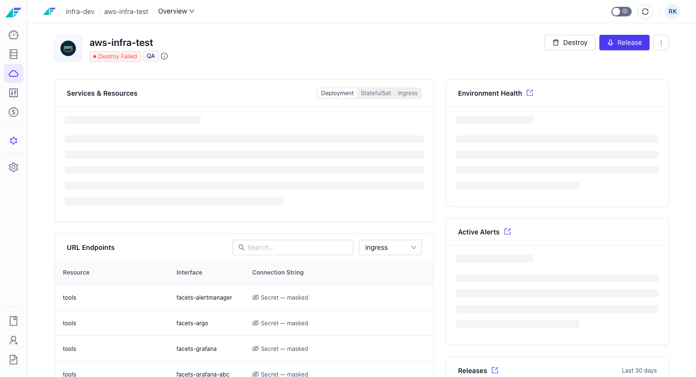

import StorylaneTour from '@site/src/components/StorylaneTour';

{/* <StorylaneTour id="abc123" /> */}

# Environment Configurations

The Environment Overview page is the main dashboard for a running environment. It consolidates health, alerts, releases, ingress, services, IaC Git sync status, and recent activity into a single view. When an environment has never been launched, the page shows an empty state with a **Launch environment** call to action.

## Overview Dashboard

The Overview dashboard is accessible at `/projects/:projectName/environments/:clusterId/overview`. It presents several information cards that give a complete picture of the environment's current state.

### Deployment Overview

The Deployment Overview card shows the latest release stats and the current deployment status for the environment. Use this card to quickly assess whether the most recent release succeeded or is still in progress.

### Health Metrics

CPU, memory, and node count tiles display current utilization with a color-coded bar:

| Utilization | Indicator |
|---|---|
| Up to 65% | Normal |
| Above 65% | Warning |
| Above 85% | Error |

> **Note:** Health Metrics are only shown when Kubernetes credentials are present for the environment.

### Active Alerts

The Active Alerts tile shows the count of currently firing alerts grouped by severity. Click through to the Monitoring and Alerts page for details.

### Ingress Endpoints

The Ingress Endpoints section lists the external URLs for the environment. Use these to verify that services are reachable after a release.

### Services and Resources

When Kubernetes credentials are present, this section lists the Kubernetes workloads running in the environment.

### IaC Git Sync Status

The IaC Git Sync Status tile shows whether the environment's blueprint is in sync with the connected Git repository. An out-of-sync indicator means the deployed state does not match the current blueprint commit.

### Recent Activity

The Recent Activity section shows the last few audit log events for the environment. Follow the link to the central audit logs page for the full history.

---

## Access Details

The Access Details page collects all connection information for resources deployed in the environment — database passwords, service URLs, and IP addresses — in one place.

**Location:** `/projects/:projectName/environments/:clusterId/env-info` (also accessible at `/access-details`)

**Page heading:** URLs and IPs

The page organises entries into tabs by resource type. Each tab displays a table with the following columns:

| Column | Description |
|---|---|
| Name | Human-readable name for the credential or endpoint |
| Key | The configuration key or identifier |
| Value | The credential value, URL, or IP address |

If no data is available for a tab, the message "No resource details for `{type}`" is shown. This is informational, not an error.

---

## Monitoring and Alerts

The Monitoring and Alerts page consolidates infrastructure metrics and alert management into a single view.

**Location:** `/projects/:projectName/environments/:clusterId/monitoring-alerts`

> **Note:** The previous `/monitoring` and `/alerts` routes redirect to `/monitoring-alerts`.

### Monitoring

The Monitoring section provides infrastructure observability for the environment:

- **Health metric tiles** — CPU, memory, and node health with color-coded utilization indicators
- **Prometheus chart integration** — time-series metrics for the environment
- **Critical events timeline** — a chronological view of significant cluster events
- **Node details** — drill into individual node status and resource usage
- **Pod details** — inspect pod-level status and resource consumption

> **Note:** The Monitoring section is only available when Kubernetes credentials are present for the environment.

### Alerts

The Alerts section shows all alerts configured and firing for the environment.

**Tabs:** firing / silenced

**Severity filter options:** critical, warning, unknown

Additional capabilities:

- View a trend chart of alert activity over a configurable number of days
- Silence active alerts directly from the table
- View the alert definitions configured for the environment

---

## K8s Debugger AI Assistant

The K8s Debugger is an AI-powered assistant for diagnosing Kubernetes issues in the environment. When conditions are met, a banner titled "Introducing Intelligence with Kubernetes Expert" appears on the Overview with a **Try K8s Debugger** button.

The assistant is displayed only when all of the following are true:

- The environment has Kubernetes credentials present
- The environment is not in a stopped or failed state
- The K8s Debugger feature is enabled for your organisation

Clicking **Try K8s Debugger** routes to the AI assistant where you can describe the issue and receive guided diagnosis.

:::info Automate with Facets Intelligence
**K8s Debugger (Facets Intelligence)**

Use the K8s Debugger to diagnose Kubernetes workload failures, pod crash loops, resource pressure, and scheduling issues with AI-guided analysis.

The assistant has access to the environment's live cluster state. Describe the symptom and the assistant will identify likely root causes and recommend remediation steps.
:::

---

## Related Topics

- [Environment Overview](./overview.mdx) - Environment types, states, and key concepts
- [Launching and Destroying Environments](./launching-destroying.mdx) - How to provision and tear down environments
- [Environment Settings](./settings.mdx) - General settings, environment type, release management, IaC configuration
- API Reference — https://apidocs.facets.cloud
