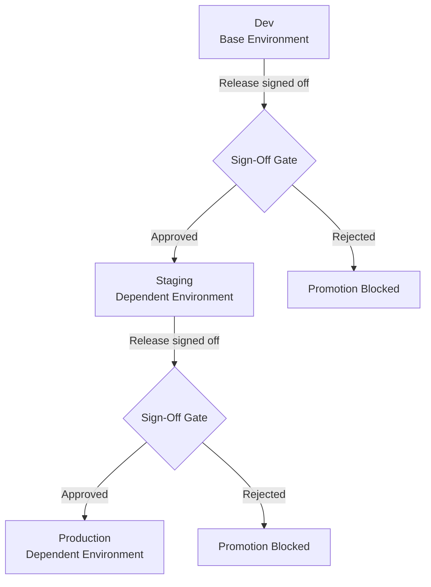

# Dependent Environments

Dependent environments model a promotion pipeline inside a project. A base (parent) environment must be signed off before releases flow to its child (dependent) environments. This lets teams gate deployments through a controlled sequence — for example, requiring a development environment to be verified before staging receives a release.

## What Are Dependent Environments

A dependent environment is linked to a parent environment within the same project. Releases do not flow to a dependent environment automatically. They wait until the parent environment's release is signed off, either by a user or on an automated schedule.

Key characteristics:

- A dependent environment displays a **Dependent** badge in its environment header.
- Only one level of nesting is supported. A child environment cannot itself be a parent in the pipeline.
- Scale Up and Scale Down operations are not available on dependent environments.
- The parent-child relationship is configured through the Delivery Pipeline page at the project level.

## Delivery Pipeline

The Delivery Pipeline is an interactive graph showing all environments in a project and their promotion relationships. Environments at the top of the graph are base environments. Environments below them, connected by lines, are dependent on their parent.

### Viewing the Delivery Pipeline

Open the Delivery Pipeline from the project-level navigation. The graph renders the current promotion order across all environments in the project.

### Configuring Parent-Child Relationships

:::info Interactive Demo
*An interactive walkthrough for this flow will be added here.*
:::

1. On the Delivery Pipeline page, click **Edit** to enter Edit Mode.
2. Drag environments to arrange the parent-child relationships.
3. Configure the sign-off policy for each environment transition (see [Sign-Off Policy](#sign-off-policy) below).
4. Click **Save** to persist the changes, or **Cancel** to discard them.

Changes are applied to the in-memory view immediately, giving instant visual feedback. They are only saved to the platform when you click **Save**.

### Sample Promotion Pipeline

The following diagram shows a typical three-environment pipeline with sign-off gates between each stage.

*Figure: A three-environment pipeline where each stage requires sign-off before the release flows downstream*

## Sign-Off Policy

Sign-off gates a release from flowing to dependent environments. A child environment does not receive a release until the parent environment's release is signed off.

Sign-off can be configured as:

- **Manual** — a user must explicitly sign off the release in the parent environment's release history table.
- **Automated** — a cron schedule (`autoSignOffSchedule`) signs off releases automatically after a configured delay.

### Signing Off a Release Manually

1. Navigate to the parent environment's Releases page.
2. Locate the release in the release history table.
3. Use one of the following actions in the table row:

| Action | Effect |
|---|---|
| **Approve Release** | Approves the release for downstream promotion |
| **Reject Release** | Rejects the release; downstream promotion is blocked |
| **Sign Off Release** | Marks the release as signed off, allowing it to flow to dependent environments |

> **Note:** The availability of each action depends on the sign-off policy configured for the environment transition.

## Restrictions on Dependent Environments

The following operations are not available on dependent environments:

- **Scale Up** — restores workloads previously scaled to zero; blocked on dependent environments.
- **Scale Down** — scales workloads to zero; blocked on dependent environments.

When a dependent environment is selected, these action buttons are not shown in the Releases page action bar.

The **Dependent** badge in the environment header indicates that an environment is a child in the delivery pipeline.

> **Tip:** You can also manage delivery pipeline configuration programmatically. See the [API Reference](https://apidocs.facets.cloud) for details.

## Related Topics

- [Launching and Destroying Environments](./launching-destroying.md) - How to provision and tear down environments
- [Environment Settings](./settings.md) - Per-environment configuration options
- [Environment Overview](./overview.md) - Environment states and lifecycle concepts
