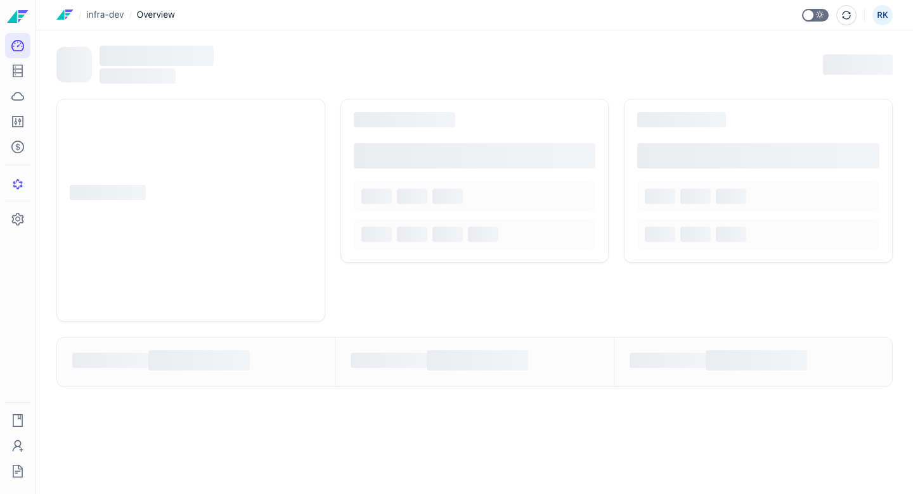
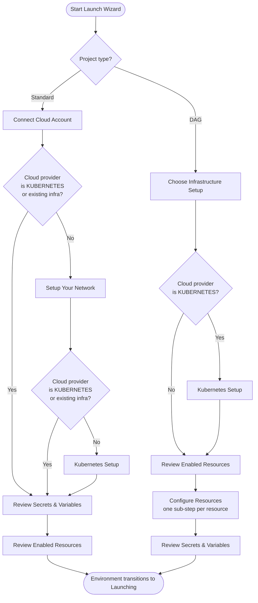

# Launching and Destroying Environments

Facets separates environment lifecycle into two distinct operations: **Launch** provisions infrastructure for the first time, and **Destroy** tears down all infrastructure while preserving the environment configuration. A separate **Delete** action permanently removes the environment record.

## Creating an Environment

:::info Interactive Demo
*An interactive walkthrough for this flow will be added here.*
:::

Before you can launch infrastructure, you must create the environment record in Facets. This establishes the environment name and assigns it to a release stream.

### Prerequisites
- You have access to a project with at least one release stream configured.
- You have the `ENVIRONMENT_LAUNCH` permission.

### Steps

1. Navigate to the **Project Overview** page for your project.
2. Click **Launch environment** (shown in the empty state) or open the create environment form from the project controls.
3. Enter an **Environment Name**. Names must be lowercase letters and numbers with hyphens, start with a letter, and be between 1 and 40 characters. Inline validation enforces this as you type.
4. Select a **Release Stream** from the dropdown.
5. Click **Create Environment**.

The environment appears in the project list in an unconfigured state. Settings sections such as Environment Type and Release Management are hidden until the environment is launched for the first time.

## Launching an Environment — Launch Wizard

:::info Interactive Demo
*An interactive walkthrough for this flow will be added here.*
:::

Launching provisions infrastructure for the environment. The first launch runs through a multi-step guided wizard. The steps shown depend on your project type.

### Launch Wizard Paths

*Figure: Launch Wizard step sequences for Standard and DAG project types. Network and Kubernetes steps are skipped when using an existing infrastructure type or a KUBERNETES cloud provider.*

### Standard Flow Steps

1. **Connect Cloud Account** — connect or select the cloud account or cluster to deploy to.
2. **Setup Your Network** — configure VPC, subnets, and networking settings. This step is hidden when using an existing infrastructure type or a KUBERNETES cloud provider.
3. **Kubernetes Setup** — configure the Kubernetes cluster settings. Hidden under the same conditions as the network step.
4. **Review Secrets & Variables** — review or set required secrets and variables for this environment.
5. **Review Enabled Resources** — review which blueprint resources will be provisioned.

### DAG Flow Steps

1. **Choose Infrastructure Setup** — select the infrastructure configuration approach.
2. **Kubernetes Setup** — configure Kubernetes cluster settings. This step appears only when the cloud provider is KUBERNETES.
3. **Review Enabled Resources** — review which resources will be provisioned.
4. **Configure Resources** — a sub-step appears for each resource that requires per-environment configuration.
5. **Review Secrets & Variables** — review or set required secrets and variables.

## Launch Lifecycle and States

When you complete the wizard, the environment transitions to **Launching** state. Facets runs the underlying Terraform provisioning at this point.

- Successful launch → **Running** state. The environment is now considered configured, and all settings sections become visible.
- Failed launch → **Launch Failed** state. The environment header shows an error color badge. Check the release logs and re-trigger **Launch** from the Releases page.

## Lifecycle Operations

All ongoing operations are available from the action bar on the Releases page for the environment.

| Operation | Description | Required Permission |
|---|---|---|
| **Launch** | Re-launch a previously destroyed environment. Does not re-run the initial wizard. | `ENVIRONMENT_LAUNCH` |
| **Release** (Full) | Deploy all resources from the current blueprint commit. | `RELEASE_FULL` |
| **Release** (Selective) | Deploy only selected resources. Also referred to as a Hotfix release. | `RELEASE_SELECTIVE` |
| **Scale Up** | Restore deployments, statefulsets, and cronjobs previously scaled to zero. Not available on dependent environments. | `RELEASE_SCALE_UP` |
| **Scale Down** | Scale all workloads to zero and disable cronjobs. Not available on dependent environments. | `RELEASE_SCALE_DOWN` |
| **Pause releases** | Block all future deployments. A **Releases Paused** tag appears in the environment header. | `RELEASE_PAUSE` |
| **Resume releases** | Unblock deployments after a pause. | `RELEASE_PAUSE` |
| **Unlock State** | Trigger an `UNLOCK_STATE` release to clear a locked Terraform state after a failed deployment. | — |
| **Export Terraform** | Trigger a `TERRAFORM_EXPORT` release that generates and packages IaC source files. Requires the feature to be enabled. | `RELEASE_TERRAFORM_EXPORT` |
| **Update IaC Version** / **Set IaC Version** | Change the Terraform version used for this environment. Version downgrades are prevented. | — |

> **Tip:** You can also trigger releases and lifecycle operations programmatically. See the [API Reference](https://apidocs.facets.cloud) for details.

## Destroying an Environment

Destroy tears down all infrastructure — services, cluster nodes, networking, and storage volumes — while preserving the environment configuration. You can re-launch the environment after destroying it.

> **Warning:** Destroy is irreversible for the provisioned infrastructure. All running workloads, data volumes, and network resources are deleted. The environment record and its configuration are retained, but restoring the environment requires a full re-launch.

### Prerequisites
- The environment must not be in **Stopped** state. The **Destroy** button is disabled when the environment is stopped.
- No pending maintenance release failure. If a maintenance release failure is blocking subsequent releases, the **Destroy** button shows a tooltip directing you to contact support.
- You have the `ENVIRONMENT_DESTROY` permission.

### Steps

1. Navigate to **Settings** for the environment.
2. Click **Danger Zone** in the settings sidebar.
3. Click **Destroy Environment**.
4. Type the environment name in the confirmation field.
5. Click the confirmation button to proceed.

The environment transitions to **Destroying** state while Facets runs the Terraform destroy operation.

## Deleting an Environment

Delete permanently removes the environment record from Facets. This action cannot be undone. Use Destroy instead if you want to preserve the environment configuration for future use.

> **Warning:** Deletion permanently removes the environment record and all associated configuration. This cannot be reversed.

### Prerequisites
- You have the `ENVIRONMENT_DESTROY` permission.

### Steps

1. Navigate to **Settings** for the environment.
2. Click **Danger Zone** in the settings sidebar.
3. Click **Delete Environment**.
4. Type the environment name in the confirmation field.
5. Click the confirmation button to proceed.

## Permissions Reference

| Action | Required Permission |
|---|---|
| Launch | `ENVIRONMENT_LAUNCH` |
| Full Release | `RELEASE_FULL` |
| Full Release (allow destroy) | `RELEASE_FULL_ALLOW_DESTROY` |
| Selective Release | `RELEASE_SELECTIVE` |
| Selective Release (allow destroy) | `RELEASE_SELECTIVE_ALLOW_DESTROY` |
| Custom Release | `RELEASE_CUSTOM` |
| Scale Up | `RELEASE_SCALE_UP` |
| Scale Down | `RELEASE_SCALE_DOWN` |
| Pause / Resume Releases | `RELEASE_PAUSE` |
| Export Terraform | `RELEASE_TERRAFORM_EXPORT` |
| Destroy / Delete | `ENVIRONMENT_DESTROY` |
| Configure Settings | `ENVIRONMENT_CONFIGURE` |

## Troubleshooting

| Problem | Solution |
|---|---|
| Environment stuck in **Launch Failed** state | Check the release logs for the LAUNCH release type. Re-trigger **Launch** from the action bar on the Releases page. |
| **Destroy** button is disabled | Check whether the environment is in **Stopped** state (destroy is blocked when stopped). If a maintenance release failure is pending, a tooltip directs you to contact support. |
| Environment shows **Destroy Failed** badge | Open the release history on the Releases page and check the Terraform logs for the DESTROY release. |
| **Scale Up** / **Scale Down** buttons are missing | Scale Up and Scale Down are not available on dependent environments. |
| **Releases Paused** banner appears on the Releases page | All deployments are paused. Click **Resume releases** in the action bar to unblock them. |
| A failed maintenance release blocks all releases | A tooltip appears on the **Release** button. Contact support to resolve the maintenance release failure. |
| Terraform state is locked after a failed deployment | Use the **Unlock State** button in the action bar to trigger an `UNLOCK_STATE` release and clear the lock. |

## Related Topics

- [Environment Overview](./configurations.md) - Dashboard, health metrics, and access details for a running environment
- [Environment Settings](./settings.md) - General settings, environment type, release schedule, IaC settings, and Danger Zone
- [Dependent Environments](./dependent-environments.md) - Promotion pipelines and sign-off policies between environments
