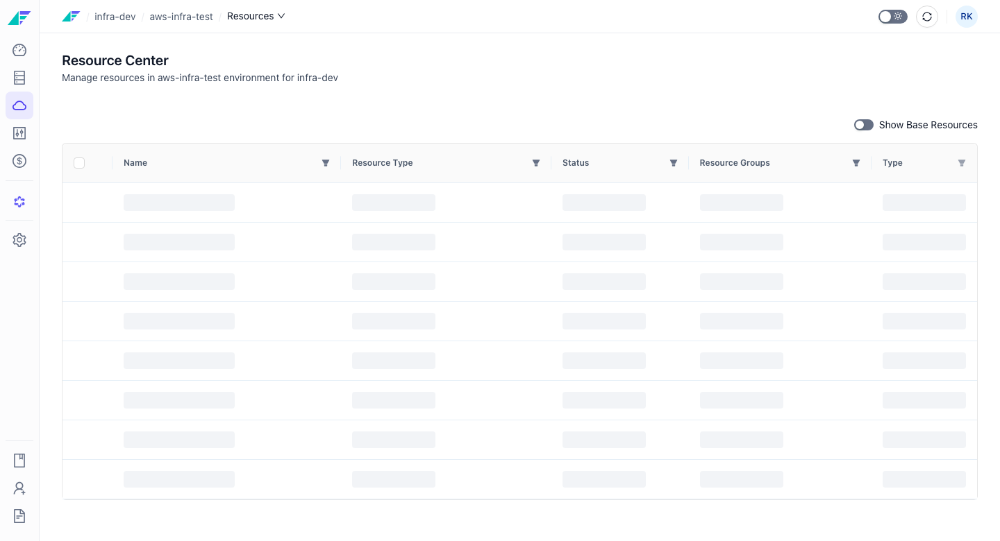
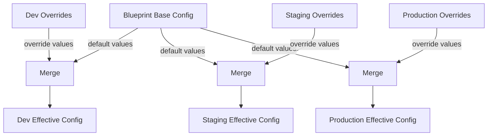

# Overriding Resources in an Environment

The blueprint defines resources at the project level — it is the shared source of truth for all environments in a project. Resource overrides let you customize those resource configurations for a specific environment without altering the shared blueprint. Each override is applied on top of the blueprint base at release time to produce the effective configuration that Facets deploys.

## How Resource Overrides Work

The blueprint holds the base (default) configuration for every resource in the project. An override is a set of field values that apply only when deploying that resource to a specific environment.

Key properties of overrides:

- **Overrides do not modify the blueprint.** They are stored separately on the environment object.
- **Only differing fields need to be set.** You do not need to repeat blueprint values in an override — only the fields that should differ for the target environment.
- **Effective configuration = blueprint base + environment overrides.** At release time, Facets merges the two to produce the final configuration that is deployed.

*Figure: Blueprint base configuration merges with per-environment overrides at release time, producing a distinct effective configuration for each environment*

Override fields take precedence over blueprint defaults during the merge. Fields not present in an override inherit their value from the blueprint base unchanged.

> **Note:** Overrides take effect on the **next release** to the target environment. Saving an override does not immediately redeploy the resource.

## Setting a Resource Override

:::info Interactive Demo
*An interactive walkthrough for this flow will be added here.*
:::

You need the `ENVIRONMENT_CONFIGURE` permission to set resource overrides.

1. Navigate to the project blueprint and open the resource you want to override.
2. Select the **Overrides** tab on the resource configuration page.
3. Choose the target environment from the environment selector.
4. The form pre-fills with the current blueprint values. Edit only the fields that should differ for this environment.
5. Save the override.

The override is stored against the selected environment and takes effect on the next release to that environment.

> **Tip:** You can also manage overrides programmatically. See the [API Reference](https://apidocs.facets.cloud) for details.

## Viewing Overrides Per Environment

To see the resources enabled in a specific environment along with their effective configuration:

1. Open the environment.
2. Navigate to the **Resources** tab.

The Resources tab lists all resources enabled in that environment. Each resource reflects its merged configuration — blueprint base values combined with any active overrides for that environment.

> **Note:** The direct URL for per-environment resource override configuration is `/projects/:projectName/blueprint/:branchName/configure/:resourceType/:resourceName/overrides/:envId`. The environment-scoped resource list is at `/projects/:projectName/environments/:clusterId/resources`.

## Variables and Secrets as Environment-Scoped Configuration

In addition to per-resource overrides, environments store variables and secrets at the environment level. These are a separate, complementary mechanism:

- **Resource overrides** apply to the configuration fields of a specific resource for a specific environment.
- **Environment variables and secrets** are key-value pairs available across all resources in an environment at runtime.

Environment-level variables are accessible at `/projects/:projectName/environments/:clusterId/variables`. They are managed separately from resource overrides and are documented in the Secrets and Variables topic.

## Permissions

| Action | Required Permission |
|---|---|
| Set or update a resource override | `ENVIRONMENT_CONFIGURE` |

## Related Topics

- [Environment Settings](./settings.md) — General environment configuration options
- [Template Inputs](./template-inputs.md) — Project-level parameters that affect multiple resources across an environment
- Secrets and Variables — Environment-scoped variables and secrets managed separately from resource overrides
- [API Reference](https://apidocs.facets.cloud) — Programmatic access to override management
