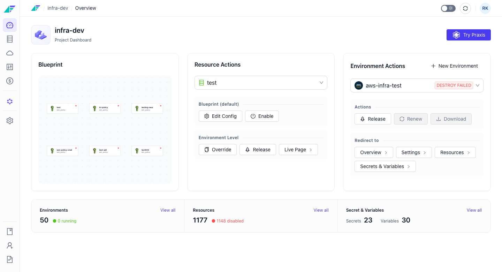
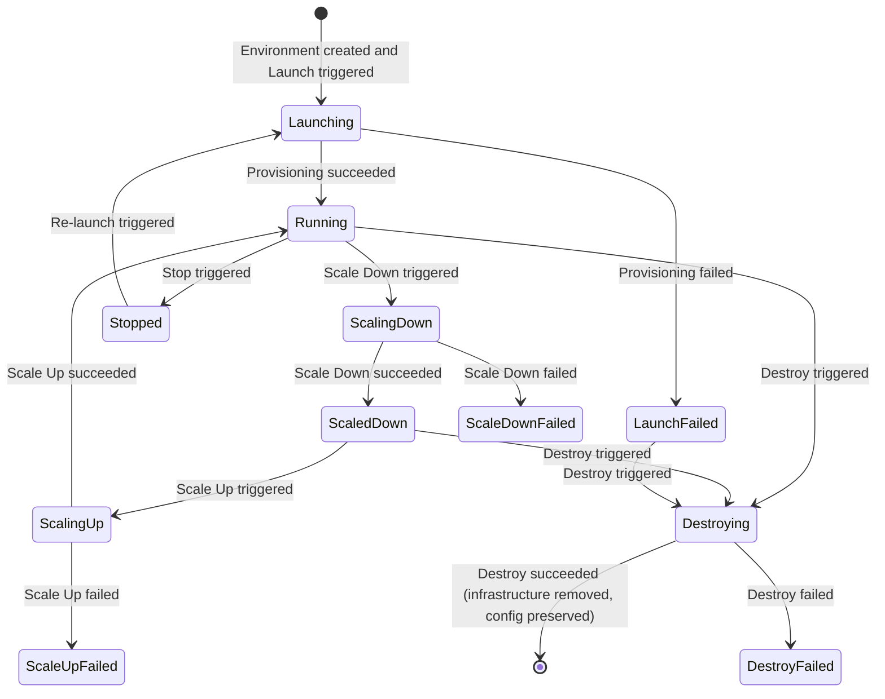

import StorylaneTour from '@site/src/components/StorylaneTour';

{/* <StorylaneTour id="abc123" /> */}

## What is an Environment

An environment is a deployed instance of a project's blueprint onto a cloud account or Kubernetes cluster. Each project can have multiple environments — such as development, staging, and production — that share the same resource definitions but run independently with their own infrastructure, configuration, and lifecycle.

Every environment belongs to exactly one project. All environments in a project share the same blueprint (the resource definitions), but each environment deploys that blueprint to its own infrastructure. Environments can be promoted to one another through a Delivery Pipeline, and each tracks which artifact versions are eligible for deployment through a Release Stream.

Facets supports the following cloud providers for environments:

- **AWS**
- **Azure**
- **GCP**
- **Kubernetes**
- **Local**
- **No-Cloud**

## Environment States

Every environment has a current state displayed as a badge on the environment card in the Project Overview. The state reflects the last known lifecycle operation.

| State | Meaning |
|---|---|
| **Running** | The environment is active and available |
| **Stopped** | The environment has been stopped; destroy is blocked in this state |
| **Launching** | The environment is being provisioned for the first time |
| **Destroying** | Infrastructure teardown is in progress |
| **Launch Failed** | Initial provisioning failed; the environment header shows an error color badge |
| **Destroy Failed** | Teardown failed; infrastructure may be partially removed |
| **Scaling Up** | A Scale Up operation is in progress |
| **Scaling Down** | A Scale Down operation is in progress |
| **Scaled Down** | All workloads are scaled to zero |
| **Scale Down Failed** | The Scale Down operation failed |
| **Scale Up Failed** | The Scale Up operation failed |

The diagram below shows how states relate to one another across the environment lifecycle:

*Figure: Environment lifecycle states and valid transitions*

> **Note:** Destroy is blocked when the environment is in **Stopped** state. To destroy a stopped environment, re-launch it first, then destroy once it reaches **Running**.

## Environment Types

An environment type controls how the environment behaves over time. The type is configured in **Settings > Environment Type** after the environment has been launched at least once.

| Type | Behavior |
|---|---|
| **Regular Environment** | Runs continuously and is always available |
| **Time Sensitive Environment** | Automatically starts and stops on a user-configured schedule |
| **Short Lived Environment** | Automatically tears down after a specified duration (ephemeral) |

Time Sensitive and Short Lived environments are useful for cost management. Development or testing environments that do not need to run overnight or on weekends can be scheduled to stop or destroyed automatically.

## Relationship to Projects, Blueprints, and Release Streams

All environments in a project share the same **blueprint** — the set of resource definitions that describes what infrastructure to provision. Each environment deploys that blueprint independently, so configuration changes to one environment do not affect others.

**Release Streams** control which artifact versions are eligible for deployment in an environment. You select a release stream when creating an environment and can change it later in **General Settings**.

Environments can be arranged in a **Delivery Pipeline** that establishes a parent-child promotion order. A release must be signed off in a parent environment before it flows to dependent (child) environments. See [Dependent Environments](./dependent-environments.mdx) for details.

## Key Concepts

### Configured vs. unconfigured environments

An environment that has never been launched has a configured status of `false`. Several settings sections — including **Environment Type**, **Release Management**, and **Kubernetes Config** — are hidden until the environment is configured (launched at least once). After a successful first launch, those sections become visible.

### Destroy vs. Delete

These are two distinct operations with different effects:

- **Destroy** — tears down all infrastructure (services, nodes, networking, storage) but preserves the environment configuration. The environment can be re-launched later.
- **Delete** — permanently removes the environment record. This cannot be undone.

Both operations require typing the environment name to confirm and are gated by the `ENVIRONMENT_DESTROY` permission.

### Releases Paused

When releases are paused on an environment, all deployments to that environment are blocked until explicitly resumed. A **Releases Paused** tag appears in the environment header. Use the **Resume releases** action on the Releases page to unblock deployments.

## Facets Intelligence — K8s Debugger

When an environment has Kubernetes credentials and the cluster is in a running state, a **Try K8s Debugger** action is available on the environment overview. This routes to an AI-powered Kubernetes troubleshooting assistant that can diagnose issues in your running workloads.

> **Tip:** You can also perform environment operations programmatically. See the [API Reference](https://apidocs.facets.cloud) for details.

## Related Topics

- [Environment Configurations](./configurations.mdx) — Overview dashboard, access details, monitoring, and alerts
- [Launching and Destroying Environments](./launching-destroying.mdx) — Create, launch, destroy, and delete environments
- [Environment Settings](./settings.mdx) — General settings, environment type, release management, IaC, VPN, and danger zone
- [Dependent Environments](./dependent-environments.mdx) — Delivery pipelines and sign-off policies
- [Overriding Resources in an Environment](./overriding-resources.mdx) — Per-environment resource configuration overrides
- [Template Inputs](./template-inputs.mdx) — Blueprint-level parameters configured per environment
- Releases — Release streams, artifact versions, and release management
