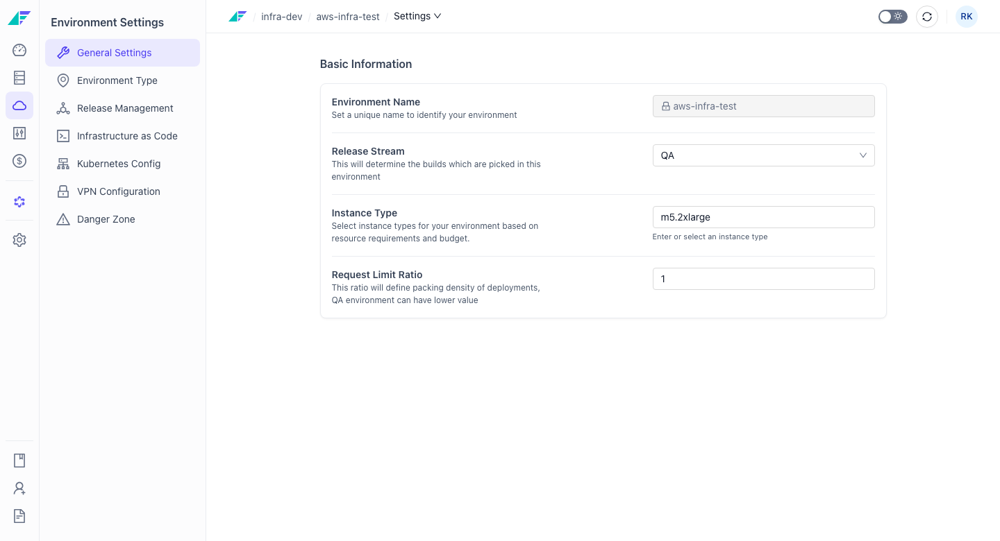

import StorylaneTour from '@site/src/components/StorylaneTour';

{/* <StorylaneTour id="abc123" /> */}

# Environment Settings

The Environment Settings page is the central place to configure an environment's behavior, infrastructure version, release scheduling, networking, and lifecycle actions. Access it from the **Settings** tab on any environment.

Settings are organized in a sidebar with hash-based navigation. Not all sections are visible for every environment — some sections are hidden until the environment has been launched at least once, and others appear only for legacy project types.

**Sidebar sections:**
- General Settings
- Environment Type
- Release Management
- Infrastructure as Code
- Kubernetes Config (legacy project types only)
- VPN Configuration (legacy project types only)
- Danger Zone

> **Note:** The **Environment Type**, **Release Management**, and **Kubernetes Config** sections are only visible after the environment has been configured (launched at least once).

## General Settings

**Hash:** `#general`

General Settings controls the core identity and resource configuration of an environment.

:::info Interactive Demo
*An interactive walkthrough for this flow will be added here.*
:::

**Fields:**

| Field | Description |
|---|---|
| Environment Name | Read-only display of the environment name. Names cannot be changed after creation. |
| Release Stream | Select which release stream this environment tracks. The change takes effect on the next release. |
| Instance Types | Cloud-specific field for configuring the instance or node types used in this environment. |
| Kubernetes Requests-to-Limits Ratio | Numeric ratio controlling how resource requests map to limits for Kubernetes workloads. Default is `0.8`. |

Saving is blocked if the form has validation errors.

> **Tip:** You can also update the Release Stream programmatically. See the [API Reference](https://apidocs.facets.cloud) for details.

## Environment Type

**Hash:** `#environment-type`

Environment Type controls whether the environment runs continuously, on a schedule, or tears down automatically after a set duration.

> **Note:** This section is only visible after the environment has been configured (launched at least once).

:::info Interactive Demo
*An interactive walkthrough for this flow will be added here.*
:::

**Available types:**

### Regular Environment

Runs continuously and is always available. This is the default type for most environments.

### Time Sensitive Environment

Automatically starts and stops based on a configured schedule. Use this type for non-production environments that do not need to run around the clock, reducing infrastructure costs during off-hours.

To configure:
1. Select **Time Sensitive Environment**.
2. Set a start schedule and a stop schedule.
3. Click **Save**.

### Short Lived Environment

Automatically tears down after a specified duration. Use this type for ephemeral environments such as feature branches or one-time test deployments.

To configure:
1. Select **Short Lived Environment**.
2. Set the duration after which the environment should tear down.
3. Click **Save**.

## Release Management

**Hash:** `#releases`

Release Management controls automated release scheduling and the compute resources allocated to the release runner pod.

> **Note:** This section is only visible after the environment has been configured (launched at least once).

:::info Interactive Demo
*An interactive walkthrough for this flow will be added here.*
:::

### Automated Release Schedule

Configure releases to trigger automatically at a fixed frequency. Available options:

| Schedule | Description |
|---|---|
| HOURLY | Releases run every hour. |
| DAILY | Releases run daily at a configurable interval and time. |
| WEEKLY | Releases run weekly on a selected day of the week and time. |

To set a schedule:
1. Select the desired frequency (HOURLY, DAILY, or WEEKLY).
2. Configure the time and interval fields that appear for the selected option.
3. Save.

### Release Pod Resources

Tune the CPU and memory settings for the release runner pod. Adjust these values if the environment has resource constraints or if releases are slow due to insufficient compute.

## Infrastructure as Code

**Hash:** `#iac`

The Infrastructure as Code section controls the Terraform version in use for this environment and any maintenance windows during which releases are held.

:::info Interactive Demo
*An interactive walkthrough for this flow will be added here.*
:::

### Terraform Version

Select the major version, minor version, and stream for the Terraform version used in this environment.

> **Warning:** Version downgrades are prevented. Once a Terraform version is set and the environment is launched, the initial version is tracked and enforced. You cannot select a lower version.

To update the Terraform version:
1. Navigate to **Infrastructure as Code**.
2. Select the target major version, minor version, and stream.
3. Save.

### Maintenance Window

Configure a time window during which releases are held and not executed. This is useful for change-freeze periods or scheduled maintenance.

> **Note:** The Maintenance Window field is only shown for configured environments.

To configure a maintenance window:
1. Set the start and end times for the window.
2. Save. Releases that would execute during this window are held until the window ends.

### Pending Migrations

A table listing any pending Terraform state migrations for this environment. This table is only shown for configured environments. Review pending migrations before triggering a release to avoid unexpected state changes.

## Kubernetes Config

**Hash:** `#kubernetes`

> **Note:** This section is only visible for legacy project types.

Kubernetes Config provides a schema-driven form for configuring cluster-specific Kubernetes settings such as node pools, autoscaling parameters, and networking options. The fields shown depend on the Kubernetes configuration schema defined for the project.

:::info Interactive Demo
*An interactive walkthrough for this flow will be added here.*
:::

After updating any values, save the form. Changes take effect on the next release.

## VPN Configuration

**Hash:** `#vpn`

> **Note:** This section is only visible for legacy project types.

VPN Configuration manages network access to the environment over VPN.

:::info Interactive Demo
*An interactive walkthrough for this flow will be added here.*
:::

**Fields and actions:**

| Field / Action | Description |
|---|---|
| Enable / Disable VPN | Toggle to activate or deactivate VPN access for this environment. |
| Accessible IP Ranges | CIDR ranges that should be reachable over the VPN connection. |
| Download VPN Profile | Downloads the VPN client configuration file for connecting to this environment. |
| Trigger VPN Release | Runs a VPN-specific release to apply any VPN configuration changes. |

To update VPN settings:
1. Enable or disable the VPN toggle as needed.
2. Update the **Accessible IP Ranges** with any CIDR blocks that need access.
3. Save the configuration.
4. Click **Trigger VPN Release** to apply the changes to the running environment.

After downloading the VPN profile, import it into your VPN client to establish a connection.

## Danger Zone

**Hash:** `#danger-zone`

The Danger Zone contains irreversible lifecycle actions for the environment. Both actions require you to type the environment name before proceeding and are gated by the `ENVIRONMENT_DESTROY` permission.

### Destroy Environment

Tears down all infrastructure associated with the environment — services, cluster nodes, networking, and storage volumes — while preserving the environment configuration. The environment can be re-launched after it is destroyed.

> **Warning:** Destroying an environment removes all running infrastructure. This action cannot be undone. The environment configuration is preserved, but all data stored in ephemeral resources (databases, volumes) may be lost.

For full destroy steps, see [Launching and Destroying Environments](./launching-destroying.md).

**Restrictions:**
- Destroy is blocked when the environment is in **Stopped** state.
- Destroy is blocked when a maintenance release failure is pending. A tooltip directs you to contact support in this case.

### Delete Environment

Permanently removes the environment record. Unlike Destroy, Delete cannot be undone and does not preserve configuration.

> **Warning:** Deleting an environment is permanent. The environment record, all configuration, and all history are removed and cannot be recovered.

For full delete steps, see [Launching and Destroying Environments](./launching-destroying.md).

## Permissions

| Action | Required Permission |
|---|---|
| Modify any settings section | `ENVIRONMENT_CONFIGURE` |
| Destroy environment | `ENVIRONMENT_DESTROY` |
| Delete environment | `ENVIRONMENT_DESTROY` |

## Related Topics

- [Launching and Destroying Environments](./launching-destroying.md) — Full steps for destroy and delete operations
- [Environment Configurations](./configurations.md) — Overview dashboard, health metrics, and access details
- Dependent Environments — How dependent environments relate to settings and lifecycle restrictions
