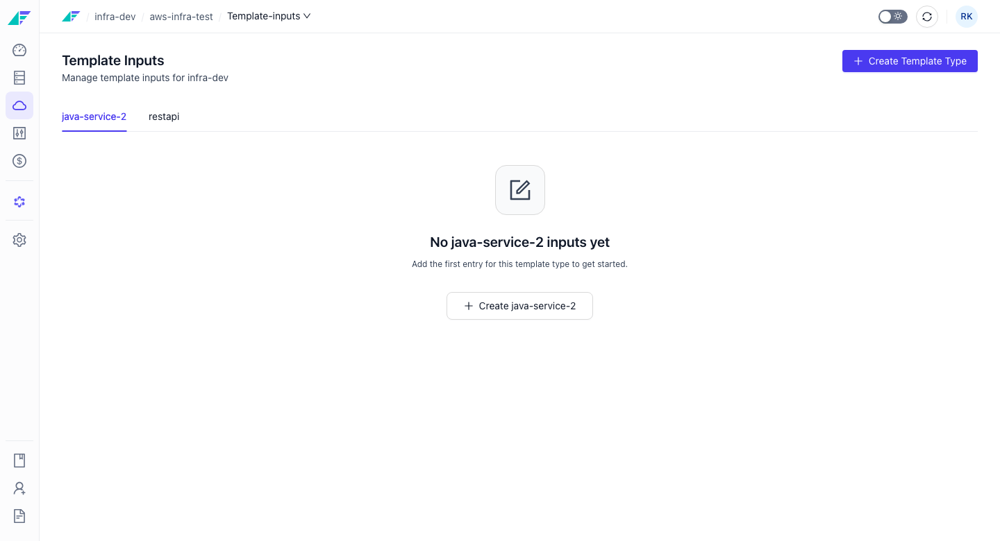

import StorylaneTour from '@site/src/components/StorylaneTour';

{/* <StorylaneTour id="abc123" /> */}

# Template Inputs

Template Inputs are parameters that a project blueprint exposes for per-environment configuration. They let blueprint designers define a set of configurable inputs that operators fill in when deploying to a specific environment, without modifying the shared blueprint itself.

Think of template inputs as the equivalent of Terraform input variables: the blueprint is the module, and the template inputs are the variable values passed in at deploy time. Each environment in a project can carry its own set of values for those inputs.

Template inputs are accessed at: `/projects/:projectName/environments/:clusterId/template-inputs`

## What Are Template Inputs

A blueprint defines resources at the project level and is shared across all environments in a project. Template inputs extend that model by allowing the blueprint designer to expose named parameters — such as instance sizes, region identifiers, replica counts, or feature flags — that must be filled in per environment.

This separation keeps the blueprint clean and reusable while giving operators precise control over how each environment is configured. A staging environment might use smaller instance sizes; a production environment might set higher replica counts — all without creating separate blueprints.

Key properties of template inputs:

- They are defined by the blueprint designer, not the environment operator.
- Each environment stores its own values for the inputs.
- Values are applied on the next release after they are saved.
- They operate at the project-parameter level, affecting configuration across resources, rather than targeting a single resource field.

## Viewing and Editing Template Inputs

:::info Interactive Demo
*An interactive walkthrough for this flow will be added here.*
:::

### Prerequisites
- The environment has been created.
- You have the `ENVIRONMENT_CONFIGURE` permission.

### Steps

1. Open the environment and navigate to the **Template Inputs** tab.
2. The form displays all inputs defined by the blueprint for this project.
3. Fill in or update the value for each input field.
4. Save the form. The updated values take effect on the next release to this environment.

> **Note:** The input fields shown are determined by the blueprint. If you expect an input that is not visible, confirm with the blueprint designer that it has been defined at the project level.

> **Tip:** You can also manage template inputs programmatically. See the [API Reference](https://apidocs.facets.cloud) for details.

## Relationship to Resource Overrides

Template inputs and resource overrides are both environment-scoped, but they operate at different levels of granularity:

| | Template Inputs | Resource Overrides |
|---|---|---|
| **Scope** | Project-level parameters | Single resource, single environment |
| **Defined by** | Blueprint designer | Environment operator |
| **Affects** | Multiple resources at once | One specific resource |
| **Location** | Template Inputs tab on the environment | Overrides tab on a resource in the blueprint |

Use template inputs when a blueprint parameter affects the behaviour of the entire project. Use resource overrides when you need to customise one specific resource for one specific environment.

## Related Topics

- [Overriding Resources in an Environment](./overriding-resources.md) - Set field-level values on a specific resource for a specific environment
- [Environment Settings](./settings.md) - Configure release schedules, IaC version, and environment type
- [Launching and Destroying Environments](./launching-destroying.md) - Provision and tear down environment infrastructure
