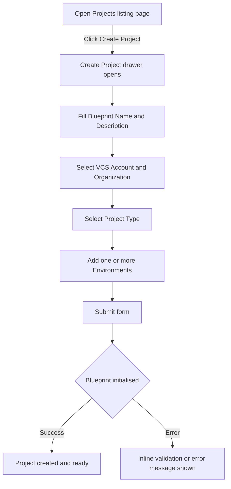

## Overview

You create new projects from the Projects listing page using the **Create Project** drawer. Two creation modes are available: create a new project from scratch (optionally using a template), or import an existing Git repository into Facets.

> **Tip:** You can also create a project programmatically. See the [API Reference](/api-reference) for details.

---

## Creating a new project

:::info Interactive Demo
*An interactive walkthrough for this flow will be added here.*
:::

The creation flow walks you through naming your project, connecting it to version control, selecting a project type, and provisioning your first environments.

*Figure: Multi-step flow from opening the drawer to a project being ready*

Follow these steps to create a project:

1. Navigate to the **Projects** listing page.
2. Click **Create Project**. The creation drawer opens on the right.
3. Enter a **Blueprint Name**. This is the project's unique identifier and cannot be changed after creation.
4. Enter an optional **Description** for the project.
5. Select a **VCS Account** — a connected GitHub, GitLab, or Bitbucket account. This is required for GitOps.
6. Select an **Organization**. The available organisations load automatically based on the VCS Account you selected.
7. Select a **Project Type** from the list. Project types are defined in OpsCenter and determine the IaC tool (for example, Terraform) and its version. Changing the project type after creation updates these automatically.
8. Add one or more **Environments**. For each environment:
   - Enter an environment name. Names must start with a lowercase letter and contain only lowercase letters, numbers, and hyphens. The maximum length is 40 characters.
   - Select a release stream.
9. Click **Submit** to create the project.

> **Note:** At least one environment is required. The form prevents submission if the VCS Account, Blueprint Name, or Environments are missing.

---

## Creating a project from a template

During creation, select an optional template from the **Template** field. When a template is selected, the platform clones the template blueprint into the new project at creation time.

Templates appear under the **Templates** tab on the Projects listing page. Any existing project saved as a template can be used here.

> **Note:** Two template systems coexist on the platform: an older system and a newer system where a project itself is marked as a template. Both are supported during project creation.

---

## Importing an existing Git repository

:::info Interactive Demo
*An interactive walkthrough for this flow will be added here.*
:::

Use this mode to bring an existing infrastructure repository into Facets without starting from scratch.

1. Open the **Create Project** drawer as described above.
2. Fill in **Blueprint Name**, **VCS Account**, **Organization**, and **Project Type**.
3. Enable the **Import Project** toggle. Three additional fields appear:
   - **Git URL** — the URL of the existing repository.
   - **Git Reference** — the branch or tag to import from.
   - **Relative Path** — the path within the repository where the blueprint lives.
4. Add at least one **Environment** with a name and release stream.
5. Click **Submit**.

When import is enabled, template application is skipped. The platform marks the project internally as an imported project and automatically configures GitOps to the imported repository.

---

## Troubleshooting

| Problem | Cause | Resolution |
|---|---|---|
| VCS Account not found | The selected VCS account is not connected or is inaccessible | Verify the VCS account is connected under your account settings and try again |
| Environment name fails validation | Name does not match the required pattern | Use lowercase letters, numbers, and hyphens only; start with a letter; keep the name between 1 and 40 characters |
| Form cannot be submitted | Required fields are missing | Check that Blueprint Name, VCS Account, and at least one Environment are filled |
| Projects listing shows an error | Network request failed | The platform retries up to two times automatically; if the error persists, refresh the page |

---

## Related Topics

- [Project Overview](./overview.md) — What you see after entering a project
- [Project Settings](./project-settings.md) — Edit description, project type, and advanced configuration
- [GitOps for Overrides](./gitops-for-overrides.md) — Back your blueprint to a Git repository
