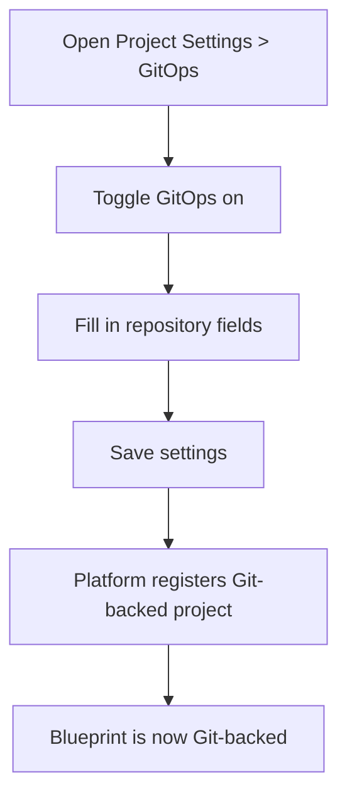

# GitOps for Overrides

GitOps connects your project blueprint to a Git repository, making the repository the source of truth for your infrastructure configuration. Git Overrides extends this by adding a separate Git source specifically for override configurations — keeping environment-specific changes isolated from the main blueprint.

## Overview

When GitOps is enabled, every change to the blueprint is backed by a Git commit. The branch you configure becomes the authoritative source for the project's state.

Git Overrides is a secondary feature within GitOps. It points to a separate repository or branch for override configurations, independent of the main blueprint repository. The **UI Overrides** toggle controls whether changes made through the UI are written back to the override repository.

You can enable GitOps at project creation or at any time afterward via **Settings > GitOps**.

> **Tip:** You can also perform GitOps configuration programmatically. See the [API Reference](https://apidocs.facets.cloud) for details.

## Prerequisites

- You have created a project.
- You have connected at least one VCS account (GitHub, GitLab, or Bitbucket).

## Enabling GitOps

:::info Interactive Demo
*An interactive walkthrough for this flow will be added here.*
:::

*Figure: How enabling GitOps connects your project to a Git repository*

1. Navigate to your project and open **Settings** from the sidebar.
2. Select **GitOps** from the settings navigation.
3. Toggle **GitOps** on.
4. Fill in the following fields:

   | Field | Description |
   |---|---|
   | **VCS Account** | The connected version-control account to use. Required before you can save. |
   | **Repository URL** | The URL of the Git repository backing the blueprint. |
   | **Branch** | The branch to use as the source of truth. |
   | **Relative Path** | The path within the repository where the blueprint files live. Leave blank if the blueprint is at the repository root. |

5. Click **Save**.

The platform registers the repository connection. The branch you specified becomes the source of truth for the project blueprint.

> **Note:** The **VCS Account** field is required. If it is not selected, the form blocks saving with an inline validation message.

## Configuring Git Overrides

Git Overrides lets you store override configurations in a separate repository or branch, keeping environment-specific changes isolated from the main blueprint.

:::info Interactive Demo
*An interactive walkthrough for this flow will be added here.*
:::

1. On the **GitOps** settings page, locate the **Git Overrides** section.
2. Toggle **Git Overrides** on.
3. Fill in the following fields:

   | Field | Description |
   |---|---|
   | **Override Repository URL** | The URL of the repository holding override configurations. |
   | **Override Branch** | The branch within the override repository to use. |

4. If you want UI changes to override configurations to write back to the override repository automatically, toggle **UI Overrides** on.
5. Click **Save**.

> **Note:** The Git Overrides repository is independent of the main blueprint repository. You can use a different repository, a different branch of the same repository, or a different path.

## Migration Status

The GitOps settings page displays the current migration status of the project's GitOps configuration. This is relevant when a project is transitioning from a non-GitOps state to a fully Git-backed state. No action is required unless the status shows an error.

## Syncing with Git

After GitOps is enabled, use **Sync with Git** on the project overview page to pull the latest state from the repository.

The sync runs in two stages:

1. The platform syncs the project blueprint synchronously.
2. It then triggers an asynchronous sync across all environments within the project.

For full details on triggering and monitoring a sync, see [Project Overview — Syncing a Project with Git](./overview.md#syncing-a-project-with-git).

## Troubleshooting

| Problem | Cause | Resolution |
|---|---|---|
| **Save is blocked on the GitOps settings page** | VCS Account not selected | Select a VCS Account from the dropdown before saving. |
| **Git sync fails during project load** | Repository access error or invalid credentials | Verify the repository URL is correct and the VCS account has read access to the repository. |
| **GitOps toggle appears off despite being enabled previously** | The toggle reflects the active state set by the user, not the model default | Check the GitOps settings page directly and toggle GitOps back on if needed. |

## Related Topics

- [Project Overview](./overview.md) — Blueprint preview, environment actions, and syncing with Git
- [Creating a Project](./creating-a-project.md) — Configure GitOps at project creation time
- [Project Settings](./project-settings.md) — Full reference for all project settings sections
