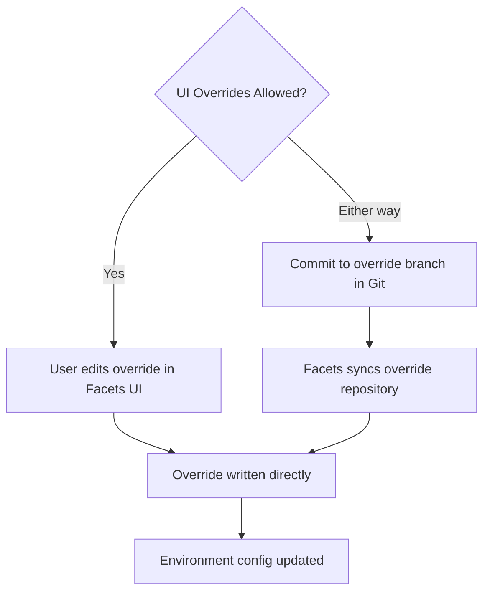

GitOps for Overrides connects a project to a Git repository so that environment-specific configuration overrides are stored in and driven from Git. This is a separate Git source from the main blueprint repository — it is used exclusively for per-environment configuration overrides.

When GitOps is active, you can choose how overrides reach environments: through commits to the override repository, through the Facets UI, or both. The **UI Overrides Allowed** toggle controls whether the Facets UI can write overrides alongside the Git source.

## Prerequisites

- You have created a project.
- You have connected at least one VCS account (GitHub, GitLab, or Bitbucket).

## Enabling GitOps

:::info Interactive Demo
*An interactive walkthrough for this flow will be added here.*
:::

1. Navigate to **Project Settings** → **GitOps**.
2. If GitOps has not been enabled before, the **Enable GitOps** toggle is visible. Toggle it on.
3. Once GitOps is enabled, the toggle is hidden. You will see only the configuration fields going forward.
4. Fill in the following fields:
   - **VCS Account** — the Git provider account to use
   - **Repository URL** — the full URL of the repository
   - **Branch** — the branch to track
   - **Relative Path** — the path within the repository where override files live
5. Click **Save**. The save button is active only when at least one field differs from its currently saved value.

> **Note:** If you open the GitOps settings and the **Enable GitOps** toggle is not visible, GitOps is already enabled for this project. Proceed directly to configuring the fields.

## Configuring Git Overrides

Git Overrides use a dedicated override repository that is separate from the main VCS repository configured above.

:::info Interactive Demo
*An interactive walkthrough for this flow will be added here.*
:::

1. In the GitOps settings page, scroll to the **Git Overrides** section.
2. Toggle **Git Overrides** on.
3. Enter the **Override Repository URL**.
4. Enter the **Override Branch**.
5. Optionally toggle **UI Overrides Allowed** to control whether environment overrides can also be submitted through the Facets UI in addition to the Git source.
6. Click **Save**.

The diagram below shows both paths by which overrides can reach an environment:

*Figure: Two paths for delivering overrides — Git-driven and UI-driven. The UI Overrides Allowed toggle determines whether both paths are active or only Git.*

> **Tip:** Use Git Overrides when you want a full audit trail for configuration changes. Enable **UI Overrides Allowed** only when ad-hoc changes from the UI are also acceptable.

## Dirty-State Tracking

GitOps settings track changes field by field. The **Save** button becomes active only when at least one field differs from the currently saved value.

Fields tracked for dirty state:

- Branch
- Relative Path
- VCS Account
- Repository URL
- Git Overrides toggle
- UI Overrides Allowed toggle
- Override Repository URL
- Override Branch
- Organization Name

If you navigate away without saving, unsaved changes are discarded.

## How Blueprint Variables Are Synced from Git

When GitOps is active, the platform reads a StackFile — a JSON file in the Git repository — to sync variable definitions, cluster variable metadata, and enabled child stacks (substacks and plugins) into the project. Any changes to this file in Git are reflected in the project's variables and substack composition.

This sync keeps the blueprint's variable definitions in Git as the source of truth. Variables and secrets counts shown on the Project Overview are computed from this synced metadata.

## Related Topics

- [Project Settings](./project-settings.md) — full settings panel including GitOps, CI/CD, and Danger Zone
- [Project Overview](./overview.md) — environment-level actions including Release and Launch
- [Variables and Secrets](../secrets/overview.md) — how variable counts are surfaced from synced metadata
