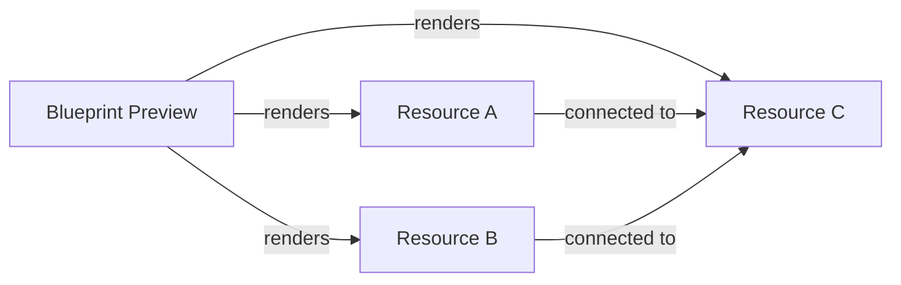
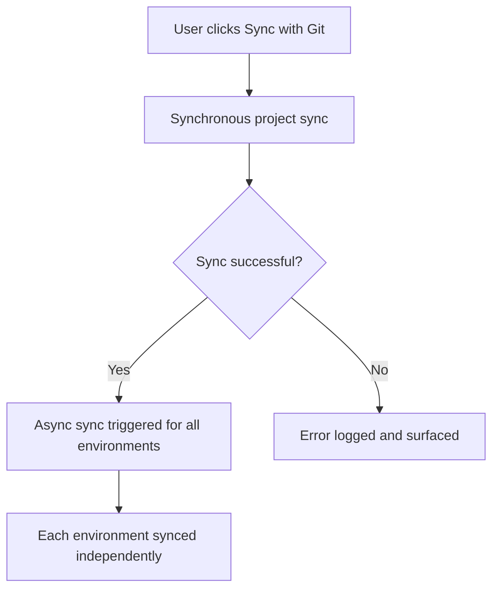

A Project is the top-level organizational unit in Facets. It holds your infrastructure blueprint, all environments, resources, variables, and configuration in one place.

## What you see on the Projects page

The Projects listing page organizes all your projects into three tabs:

| Tab | What it shows |
|---|---|
| **Projects** | Active projects you have access to |
| **Test Projects** | Projects with Preview Modules enabled |
| **Templates** | Projects saved as reusable templates |

Use the search bar to filter by name. Use the sort controls to order by name or last modified date.

## Project overview page

When you navigate into a project, the overview page gives you a summary of the project's state and quick access to environment actions.

### Blueprint preview

The blueprint preview is a read-only node graph showing all resources in the project and the connections between them. It reflects the current state of the blueprint.

*Figure: The blueprint preview renders all project resources and their connections as a read-only node graph*

> **Tip:** To edit the blueprint, open the Blueprint Designer from the project. The overview shows a read-only preview only.

### Environment list

Below the blueprint preview, the overview shows all environments in the project. Each environment entry displays:

| Field | Description |
|---|---|
| Cloud provider | The cloud the environment runs on |
| Release stream | The stream governing how deployments are promoted |
| Status | Current environment status |
| Next release time | Scheduled time for the next release |

### Stats cards

Two stats cards appear at the top of the overview:

- **Resources** — total number of blueprint resources in the project
- **Secrets / Variables** — total count of project-level variables and secrets

### Quick-action buttons

Each environment in the list has the following action buttons:

| Action | What it does |
|---|---|
| **Override Config** | Opens the override configuration for the environment |
| **Release** | Triggers a release for the environment |
| **Live Page** | Opens the live environment dashboard |
| **Kube Access** | Retrieves Kubernetes credentials for the environment |

### Pause and resume releases

Each environment has a toggle to pause or resume releases. Pausing prevents new releases from being applied to that environment. Resuming restores the normal release schedule.

> **Note:** Pausing releases requires the **PauseReleasesStackPermission** role.

### Create an environment from the overview

You can add an environment without leaving the project overview.

:::info Interactive Demo
*An interactive walkthrough for this flow will be added here.*
:::

1. On the project overview page, click **Create Environment**.
2. Enter an **Environment Name**. The name must:
   - Start with a lowercase letter
   - Contain only lowercase letters, numbers, and hyphens
   - Be between 1 and 40 characters
3. Select a **Release Stream** for the environment.
4. Click **Create** to add the environment.

The new environment appears in the environment list immediately.

### Praxis AI assistant

The **Try Praxis** button on the project overview opens Praxis, an AI assistant scoped to the project. Use Praxis to ask questions about the project's infrastructure, resources, and configuration.

## Project sidebar navigation

Within a project, the left sidebar gives you access to all project sections:

| Section | What it contains |
|---|---|
| **Overview** | The project overview page |
| **Environments** | A cascader popover listing all environments with environment-level navigation |
| **Resources** | Blueprint resource list and per-resource configuration |
| **Variables** | Project-level variables and secrets (secret values are always masked as `****`) |
| **Cost** | Cost view for the project |

## Saving a project as a template

Any project can be saved as a template. Saved templates appear under the **Templates** tab on the Projects listing page and can be selected as the basis for new projects during creation.

> **Note:** Saving a project as a template requires the **BlueprintTemplateWritePermission** role.

## Syncing a project with Git

When a project is backed by a Git repository, use **Sync with Git** to pull the latest state from the repository. Sync first updates the project synchronously, then triggers an asynchronous sync across all environments.

*Figure: Sync with Git first completes a synchronous project sync, then fans out asynchronous syncs to each environment*

> **Tip:** You can also perform this operation programmatically. See the [API Reference](/api-reference) for details.

## Permissions

| Action | Required permission |
|---|---|
| View projects (listing and overview) | StackAllowedPermission — RBAC-filtered; users see only accessible projects |
| Create a project | StackWritePermission |
| Save as template | BlueprintTemplateWritePermission |
| Pause or resume releases | PauseReleasesStackPermission |
| Delete a project | StackDeletePermission |

## Related Topics

- [Creating a Project](./creating-a-project.md) — Step-by-step project creation
- [Project Settings](./project-settings.md) — General settings, CI/CD, Danger Zone
- [GitOps for Overrides](./gitops-for-overrides.md) — Git-backed blueprints and override configuration
