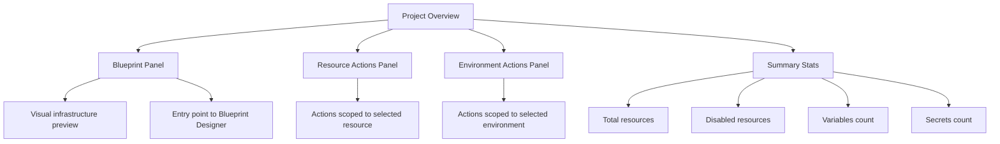

The Project Overview is the main dashboard for a project. It shows the project's infrastructure blueprint, resource and environment actions, and a summary of key metrics. This page appears after you open any project from the Projects listing.

## What the Overview Shows

The Overview gives you a snapshot of your project at a glance:

- **Total resources** — all resources defined in the blueprint
- **Disabled resources** — resources currently toggled off in the blueprint
- **Variables count** — variable entries in the project's variable metadata
- **Secrets count** — variable entries marked as secrets

> **Note:** Variables and secrets counts are computed from the project's variable metadata. Entries flagged as secret count toward the secrets total; all others count as variables.

The page is divided into three main areas: **Blueprint**, **Resource Actions**, and **Environment Actions**. On load, the Overview automatically selects the first available resource and the first available environment to pre-populate both action panels.

*Figure: How the four areas of the Project Overview relate to each other*

---

## Blueprint Panel

The **Blueprint** panel shows a visual preview of the project's infrastructure graph. It reflects the current state of the blueprint on the default branch.

To open the full Blueprint Designer — where you can add, connect, and configure resources visually — click anywhere on the blueprint preview.

To add your first resource to an empty blueprint, click **Add Resource** (or **Define a resource** if the blueprint is empty).

:::info Interactive Demo
*An interactive walkthrough for this flow will be added here.*
:::

---

## Resource Actions

The **Resource Actions** panel lists actions available for the currently selected resource. Select a different resource from the panel to switch context.

| Action | What It Does |
|---|---|
| **Edit Config** | Opens the resource configuration editor |
| **Enable** / **Disable** | Toggles the resource on or off in the blueprint (applies at the blueprint level on the default branch) |
| **Image Update** | Updates the container image for resources that have CI artifacts attached |
| **Override** | Overrides the resource's configuration for the selected environment only — does not affect the default blueprint |
| **Live Page** | Opens the live monitoring view for the resource |

> **Note:** The Overview selects the first available resource automatically when the page loads.

---

## Environment Actions

The **Environment Actions** panel lists actions available for the currently selected environment. Use the dropdown to switch between environments.

| Action | What It Does | Permission Required |
|---|---|---|
| **Release** | Triggers a full release for the selected environment | `RELEASE_FULL` |
| **Launch** | Launches the selected environment | `ENVIRONMENT_LAUNCH` |
| **Renew** | Refreshes Kubernetes credentials for the environment (credentials are valid for 24 hours) | `K8S_CREDENTIALS` |
| **Download kubeconfig** | Downloads a personal kubeconfig file for the selected environment | `K8S_CREDENTIALS` |
| **New Environment** | Opens the New Environment drawer to add an environment to the project | `STACK_WRITE` |

> **Note:** **Renew** and **Download kubeconfig** are disabled when the environment is in `STOPPED`, `DESTROY_FAILED`, or `LAUNCH_FAILED` state, or when the environment has no Kubernetes cluster or credentials.

> **Note:** Kubeconfig files expire after 24 hours. Use **Renew** to refresh the credentials before downloading a new file.

> **Note:** The Overview selects the first available environment automatically when the page loads.

---

## Creating a New Environment from the Overview

:::info Interactive Demo
*An interactive walkthrough for this flow will be added here.*
:::

1. In the **Environment Actions** panel, click **New Environment**.
2. The New Environment drawer opens.
3. In the **Environment Name** field, enter a name that:
   - Starts with a lowercase letter
   - Contains only lowercase letters, numbers, and hyphens
   - Is 40 characters or fewer
4. Select a **Release Stream**.
5. Click **Create**.

If the environment creation fails, an error message from the server appears. If no server message is returned, the fallback message "Failed to create environment" displays.

> **Note:** The **New Environment** button is visible only to users with the `STACK_WRITE` permission.

---

## Permissions

| Permission | What It Enables |
|---|---|
| `STACK_WRITE` | Create a project, save General settings, use **New Environment** |
| `ENVIRONMENT_LAUNCH` | Launch an environment |
| `RELEASE_FULL` | Trigger a full release |
| `K8S_CREDENTIALS` | Renew Kubernetes credentials or download kubeconfig |

---

## Troubleshooting

| Problem | Cause | Resolution |
|---|---|---|
| "Failed to load project" with a **Retry** button | Project data could not be fetched | Click **Retry** or check your network connection and permissions |
| "Invalid Project — Project name is missing from URL" | The URL is malformed | Click **Go to Projects** to return to the Projects listing |
| Kubeconfig download returns a 404 error | Kubernetes is not available for this environment | Verify the environment has a Kubernetes cluster configured |
| Kubeconfig download returns a 403 error | Your account lacks the `K8S_CREDENTIALS` permission | Contact your administrator to request access |
| **Renew** and **Download kubeconfig** are disabled | The environment is in `STOPPED`, `DESTROY_FAILED`, or `LAUNCH_FAILED` state, or has no Kubernetes cluster | Resolve the environment's current state before retrying |

---

## Related Topics

- **Blueprint Designer** — Full visual graph editor for adding and connecting resources
- [Creating a Project](./creating-a-project.md) — How to set up a new project from scratch
- [Project Settings](./project-settings.md) — Configure GitOps, CI/CD, and general project metadata
