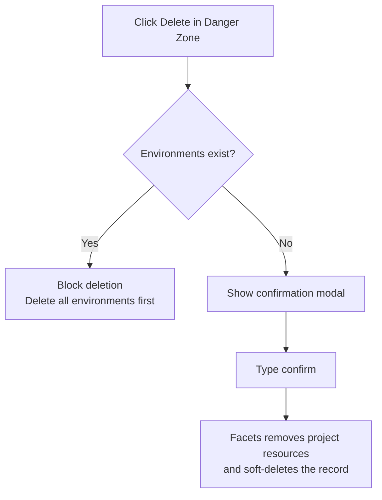

# Project Settings

Project Settings give you control over the core configuration of a project — including its description, infrastructure type, GitOps integration, CI/CD pipeline, and deletion. Access settings through the **Settings** sidebar within any project.

The Settings sidebar contains five sections:

| Section | Purpose |
|---|---|
| **General** | Edit description, project type, and test project flag |
| **GitOps** | Configure the Git repository backing the blueprint |
| **CI/CD** | Configure and reset the project-level CI/CD pipeline |
| **Delivery Pipeline** | View the release promotion flow across environments |
| **Danger Zone** | Permanently delete the project |

> **Note:** Editing General Settings and GitOps requires **StackWritePermission**. Resetting CI/CD requires **ARTIFACT_CI_WRITE** permission. Deleting a project requires **StackDeletePermission**.

> **Tip:** You can also manage project settings programmatically. See the [API Reference](/api-reference) for details.

---

## General settings

General settings let you update the project description, change the project type, and control whether the project is treated as a test project.

> **Note:** The blueprint name (project identifier) is read-only after creation. It cannot be changed.

:::info Interactive Demo
*An interactive walkthrough for this flow will be added here.*
:::

To edit general settings:

1. Navigate to your project and click **Settings** in the sidebar.
2. Select **General**.
3. Update any of the following fields:
   - **Description** — A free-text description of the project.
   - **Project Type** — Select from the project types defined in OpsCenter. Changing the project type automatically updates the IaC tool and version associated with the project.
   - **Preview Modules Allowed** — Toggle this on to mark the project as a test project. Test projects appear under the **Test Projects** tab on the Projects listing page.
4. Click **Save**.

---

## CI/CD settings

The CI/CD settings page lets you configure the project-level CI/CD pipeline, including promotion rules and workflow definitions.

Navigate to **Settings > CI/CD** to configure the pipeline. For full pipeline configuration details, see the [CI/CD documentation](../cicd/).

A **Reset** option is available to revert the CI/CD configuration to its defaults. Reset requires **ARTIFACT_CI_WRITE** permission.

---

## Delivery Pipeline

The Delivery Pipeline section shows the configured promotion sequence for releases across environments within the project. This is a read-only view.

Navigate to **Settings > Delivery Pipeline** to see the promotion flow.

---

## Deleting a project

Deleting a project is permanent and cannot be undone. Before deletion is allowed, all environments under the project must be removed.

*Figure: Deletion guard — environments must be removed before a project can be deleted*

> **Warning:** Deleting a project is permanent. It cannot be undone. Ensure you have removed all environments and backed up any configuration you need before proceeding.

To delete a project:

1. Navigate to your project and click **Settings** in the sidebar.
2. Select **Danger Zone**.
3. Review the warning. Confirm that all environments under this project have been deleted. If any environments remain, deletion is blocked with the message: "All environments must be deleted before the project can be deleted."
4. Click **Delete Project** to open the confirmation modal.
5. Type `confirm` in the confirmation field.
6. Click **Confirm Delete**.

On success, Facets cleans up temporary checkout files, removes cluster resources, removes the project from all user groups, and soft-deletes the project record.

---

## Permissions summary

| Action | Required permission |
|---|---|
| Edit General Settings | StackWritePermission |
| Reset CI/CD configuration | ARTIFACT_CI_WRITE |
| Delete project | StackDeletePermission |
| Delete override fields | OverrideFieldDeletionPermission |

---

## Troubleshooting

| Problem | Solution |
|---|---|
| Deletion blocked with "All environments must be deleted before the project can be deleted." | Delete every environment under the project first, then retry deletion. |
| Project not found — "Blueprint not found: {stackName}" | Verify the project name is correct and that you have access to it. |
| Unauthorized action | Confirm your account has the required permission for the action. See the permissions table above. |
| Save blocked in General Settings | Confirm that StackWritePermission is granted for your account. |

---

## Related Topics

- [Project Overview](./overview.md) — Environment list, blueprint preview, and quick actions
- [Creating a Project](./creating-a-project.md) — Project creation form and options
- [GitOps for Overrides](./gitops-for-overrides.md) — Git repository integration and override configuration
