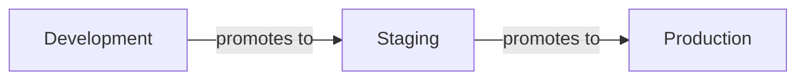

import StorylaneTour from '@site/src/components/StorylaneTour';

{/* <StorylaneTour id="abc123" /> */}

# Delivery Pipeline

The Delivery Pipeline page shows a visual tree graph of environment promotion order for a project. It represents the sequence in which releases propagate across environments — for example, from a development environment through staging to production. Access it from the project-level navigation.

## Viewing the delivery pipeline

The pipeline displays as a visual tree. Each node in the tree represents an environment. Directional connections between nodes indicate the promotion sequence — releases flow from parent environments toward child environments in the defined order.

The view is read-only by default. You must activate edit mode to make any changes.

*Figure: Example delivery pipeline showing environment nodes connected in promotion order*

## Editing the delivery pipeline

:::info Interactive Demo
*An interactive walkthrough for this flow will be added here.*
:::

1. Open the **Delivery Pipeline** page from the project-level navigation.
2. Click the edit mode toggle to enter edit mode.
3. Drag environment nodes to reorder their position in the pipeline tree.
4. Configure transition settings per environment as needed.
5. Click **Save** to persist the updated pipeline order to the platform.

> **Note:** Changes are held in memory until you explicitly save. To discard changes, exit edit mode without clicking **Save**.

## Related Topics

- [Releases Overview](./overview.md) - How releases work and available release types
- [Release Streams](./release-streams.md) - Named pipelines that categorize how releases flow through environments
- [Performing Releases](./performing-releases.md) - How to trigger releases from an environment
