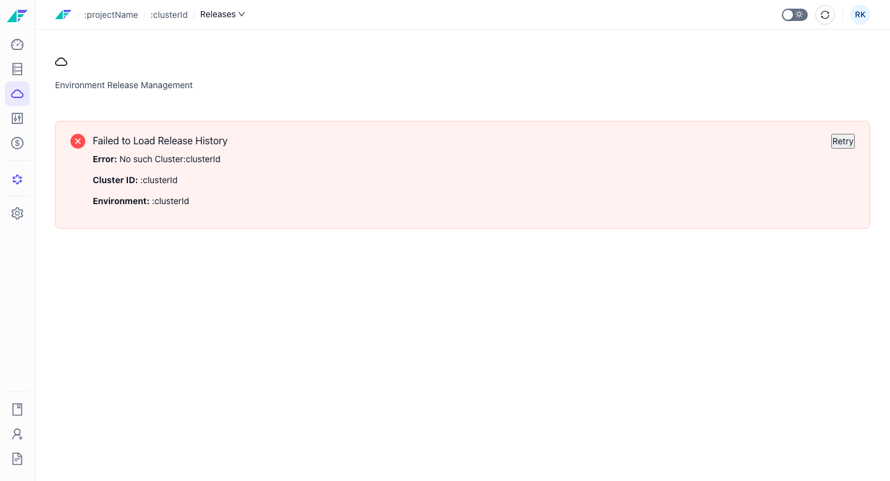

import StorylaneTour from '@site/src/components/StorylaneTour';

{/* <StorylaneTour id="abc123" /> */}

# Releases Overview

A release is the mechanism by which Facets applies blueprint and override changes to an environment's cloud infrastructure. Every change — whether a configuration update, a new build, or a scale operation — reaches an environment through a release. Each environment has its own release history and queue, and the Environment Releases page is the central hub for triggering releases, monitoring active deployments, and reviewing past results.

The page auto-refreshes every 30 seconds to reflect in-progress deployment status.

## Release stats

The stats section shows release activity for the last 30 days:

| Metric | Description |
|---|---|
| **Success** | Count of releases that completed without errors |
| **Failed** | Count of releases that failed during execution |
| **Deployment Frequency** | Successful releases divided by 30, expressed as releases per day |
| **Change Failure Rate** | Failed releases divided by total releases, expressed as a percentage |

## Active Releases

The **Active Releases** card shows in-progress and queued releases separately. Each entry displays the release type, status, the user who triggered the release, and the date and time. By default, only one release runs at a time per environment — additional releases wait in the queue until the current one finishes. Parallel release mode can be enabled to allow concurrent deployments for certain resource types.

## Release types reference

Facets supports multiple release types, each targeting a different scope of operation.

```mermaid
graph TD
    A[Release Types] --> B[Standard Deployment]
    A --> C[Plan / Apply Workflow]
    A --> D[Environment Lifecycle]
    A --> E[Utility Operations]

    B --> B1[FULL\nSync all builds and blueprint definitions]
    B --> B2[SELECTIVE\nTarget specific resources]
    B --> B3[CUSTOM\nEnter custom Terraform commands]

    C --> C1[FULL PLAN → APPLY FULL PLAN]
    C --> C2[SELECTIVE PLAN → APPLY SELECTIVE PLAN]
    C --> C3[ROLLBACK PLAN → APPLY ROLLBACK PLAN]

    D --> D1[LAUNCH\nProvision cloud infrastructure]
    D --> D2[DESTROY\nTear down cloud infrastructure]
    D --> D3[SCALE UP\nScale up deployments and statefulsets]
    D --> D4[SCALE DOWN\nScale down deployments and statefulsets]

    E --> E1[UNLOCK STATE\nUnlock the Terraform state file]
    E --> E2[TERRAFORM EXPORT\nGenerate Terraform source files]
    E --> E3[Update IaC Version\nUpdate the IaC version for the environment]
    E --> E4[MAINTENANCE\nInternal release type]
```

*Figure: All release types grouped by category*

### Standard deployment

| Release type | Description |
|---|---|
| **FULL** | Performs a full sync of all builds and blueprint definitions for the environment |
| **SELECTIVE** | Targets specific resources; lets you deploy changes to individual components without affecting the whole environment |
| **CUSTOM** | Allows entering custom Terraform commands for advanced operations |

### Plan / Apply workflow

Plans are dry-run releases. They generate a Terraform plan without applying any changes, so you can review what will happen before committing.

| Release type | Description |
|---|---|
| **FULL PLAN** | Dry-run for a Full Release |
| **APPLY FULL PLAN** | Applies the changes from a previously created Full Plan |
| **SELECTIVE PLAN** | Dry-run for a Selective Release |
| **APPLY SELECTIVE PLAN** | Applies the changes from a previously created Selective Plan |
| **ROLLBACK PLAN** | Creates a rollback plan |
| **APPLY ROLLBACK PLAN** | Applies the rollback plan |

### Environment lifecycle

| Release type | Description |
|---|---|
| **LAUNCH** | Provisions cloud infrastructure for a new environment |
| **DESTROY** | Tears down all cloud infrastructure for an environment |
| **SCALE UP** | Scales up deployments and statefulsets; re-enables cronjobs |
| **SCALE DOWN** | Scales down deployments and statefulsets; disables cronjobs |

### Utility operations

| Release type | Description |
|---|---|
| **UNLOCK STATE** | Unlocks the Terraform state file when it is locked and blocking releases |
| **TERRAFORM EXPORT** | Generates Terraform source files for the environment; must be enabled in General Settings |
| **Update IaC Version** | Updates the Infrastructure-as-Code version for the environment |
| **MAINTENANCE** | Internal release type; a failed maintenance release blocks all subsequent releases for the environment |

## Release queue behavior

Releases are queued sequentially per environment by default. Only one release runs at a time unless parallel release mode is enabled. Parallel mode is controlled at the platform level and allows certain resource types to deploy concurrently.

A release that results in no infrastructure changes is recorded with status **FAULT**. This is not a failure — it means Terraform found no diff. A toggle on the release history page controls whether these entries appear in the history list.

> **Note:** A failed **MAINTENANCE** release blocks all subsequent releases for that environment. Contact support to resolve this state.

## Related Topics

- [Performing Releases](./performing-releases.md) - How to trigger each release type
- [Release Approval Workflow](./approval-workflow.md) - Approving and rejecting releases
- [Parallel Releases](./parallel-releases.md) - Running multiple releases concurrently
- Release History - Viewing and filtering past releases
- Release Streams - Named pipelines for categorizing release flow
- Delivery Pipeline - Visual environment promotion graph
