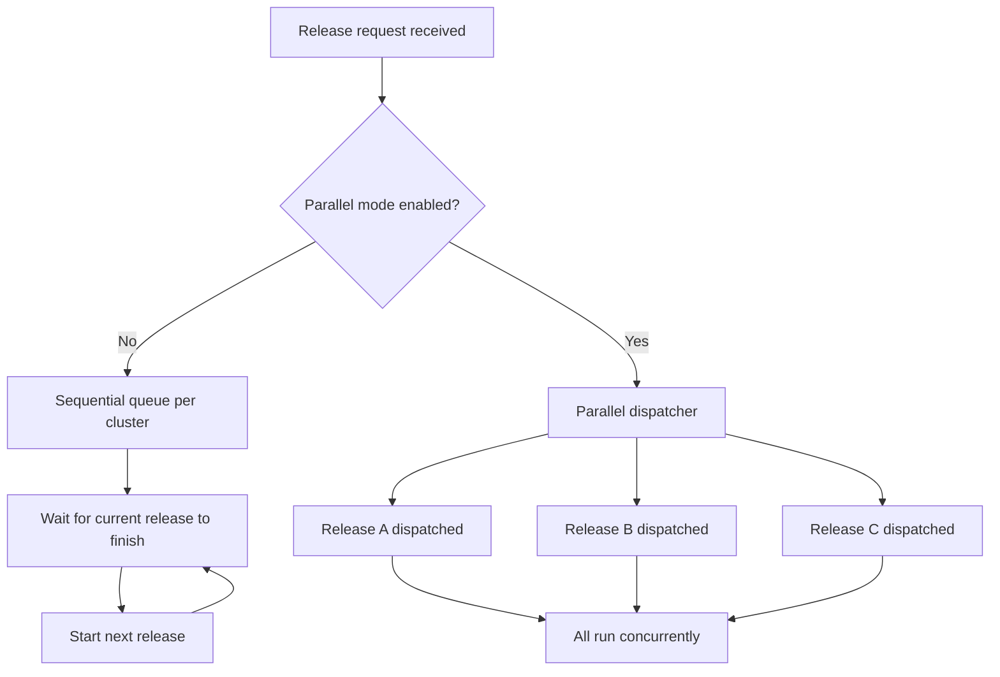

# Parallel Releases

By default, releases for an environment are queued sequentially — only one release runs at a time per environment. Parallel release mode allows certain resource types to deploy simultaneously rather than waiting in the queue, reducing overall deployment time when multiple releases are pending.

## How Parallel Releases Work

In sequential mode, every release for a cluster waits for the previous one to complete before the next one starts. When parallel mode is enabled, the release dispatcher switches to a parallel dispatch path and eligible release types are dispatched concurrently.

The diagram below shows the difference between the two modes:

*Figure: How releases are dispatched in sequential mode versus parallel mode*

### Sequential mode

Each release for a cluster enters a queue. The dispatcher starts a release only after the preceding one completes. This is the default behavior and ensures no two releases modify the same environment infrastructure at the same time.

### Parallel mode

When parallel mode is enabled, eligible release types are dispatched at the same time without waiting for each other. A platform-level setting controls the maximum number of releases that can run concurrently.

## Enabling Parallel Releases

Parallel releases are controlled by the `feature.parallel-releases-all-resources` feature flag at the platform level. This flag is managed by a Facets administrator — it is not configurable per environment or per user.

Contact your Facets administrator to enable this feature for your platform.

## Queue Behavior Details

Whether running in sequential or parallel mode, the following queue behaviors apply:

- The **Active Releases** card on the Environment Releases page shows both in-progress and queued releases, with release type, status, the user who triggered the release, and a timestamp.
- A queued release can be cancelled from the **Active Releases** card before it starts.
- If a queued release cannot be submitted — for example, because no executor is available — it is removed from the queue and an error is returned.

> **Note:** Cancelling a queued release does not affect releases that are already running. Only releases still waiting in the queue can be cancelled.

> **Tip:** You can also manage queued releases programmatically. See the [API Reference](https://apidocs.facets.cloud) for details.

## Related Topics

- [Releases Overview](./overview.md) — How releases work and the types available
- [Performing Releases](./performing-releases.md) — How to trigger releases from the Environment Releases page
