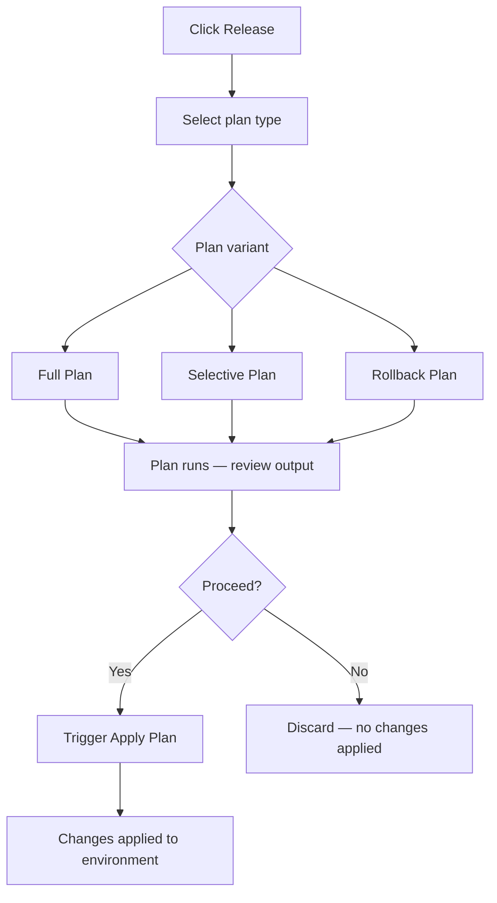
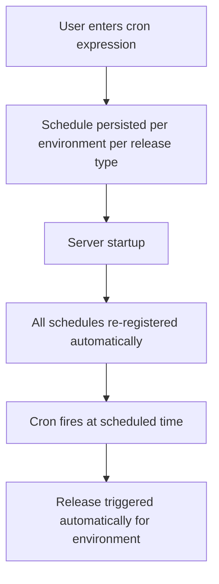

# Performing Releases

The Environment Releases page is where you trigger all release types for an environment. Every release follows a two-step flow: Step 1 selects options and Step 2 reviews and confirms before submission.

## Triggering a Full Release

A Full Release performs a full sync of all builds and blueprint definitions for the environment.

:::info Interactive Demo
*An interactive walkthrough for this flow will be added here.*
:::

1. Navigate to the Environment Releases page for your environment.
2. Click **Release**.
3. In Step 1, select **Full Release** as the release type.
4. Configure the available options:
   - **withRefresh** — refreshes builds before applying.
   - **forceRelease** — forces the release to run even if no changes are detected.
   - **allowDestruct** — permits destructive operations. Requires the `RELEASE_FULL_ALLOW_DESTROY` permission in addition to `RELEASE_FULL`.
5. Add an optional comment to describe the release.
6. Click through to Step 2 to review your selections.
7. Confirm to submit the release.

> **Note:** Triggering a Full Release requires the `RELEASE_FULL` permission. If you enable **allowDestruct**, the `RELEASE_FULL_ALLOW_DESTROY` permission is also required.

## Triggering a Selective Release

A Selective Release targets specific resources rather than the entire environment. This is useful when you want to apply changes to a subset of resources without a full sync.

:::info Interactive Demo
*An interactive walkthrough for this flow will be added here.*
:::

1. Click **Release** on the Environment Releases page.
2. In Step 1, select **Selective Release** as the release type.
3. A resource table appears showing resources with pending changes. Each resource shows its change type: Override, Blueprint, or State.
4. Select one or more resources. Use the resource group filter to narrow the list.
5. Optionally enable **allowDestruct** to permit destructive operations.
6. Add an optional comment.
7. Click through to Step 2 to review your selections.
8. Confirm to submit the release.

> **Note:** Triggering a Selective Release requires the `RELEASE_SELECTIVE` permission. Enabling **allowDestruct** additionally requires `RELEASE_SELECTIVE_ALLOW_DESTROY`.

> **Tip:** You can navigate directly into a Selective Release pre-selecting a specific resource using the URL parameter `?action=release&resource=type/name`. This deep-link is used by the Resource Configuration page's **Release Now** action.

## Triggering a Custom Release

A Custom Release lets you enter custom Terraform commands to run against the environment.

:::info Interactive Demo
*An interactive walkthrough for this flow will be added here.*
:::

1. Click **Release** on the Environment Releases page.
2. In Step 1, select **Custom Release** as the release type.
3. Enter your custom Terraform commands in the input field.
4. Click through to Step 2 to review.
5. Confirm to submit the release.

> **Note:** Triggering a Custom Release requires the `RELEASE_CUSTOM` permission. If the commands include destructive operations, `RELEASE_CUSTOM_ALLOW_DESTROY` is also required.

## Plan and apply workflow

Plans are dry-run releases — they generate a Terraform plan without applying any infrastructure changes. Use a plan to review what will change before committing.

:::info Interactive Demo
*An interactive walkthrough for this flow will be added here.*
:::

*Figure: Plan/Apply lifecycle for Full, Selective, and Rollback variants*

### Creating a plan

1. Click **Release** and select the plan type: **Full Plan**, **Selective Plan**, or **Rollback Plan**.
2. Configure any applicable options (resource selection for Selective Plan).
3. Confirm in Step 2 to submit the plan.
4. The plan runs and records a `FULL PLAN`, `SELECTIVE PLAN`, or `ROLLBACK PLAN` entry in the release history.
5. Open the release entry to review the Terraform plan output.

> **Note:** Creating a plan requires the `RELEASE_PLAN` permission.

### Applying a plan

After a plan succeeds, trigger the corresponding apply to execute those changes:

- **Apply Full Plan** — applies a previously created Full Plan.
- **Apply Selective Plan** — applies a previously created Selective Plan.
- **Apply Rollback Plan** — applies a previously created Rollback Plan.

> **Note:** Applying a plan requires the `RELEASE_APPLY_PLAN` permission.

> **Tip:** You can also trigger an Apply Plan from the Release Details drawer of the completed plan entry. See Release History for details.

## Rollback

:::info Interactive Demo
*An interactive walkthrough for this flow will be added here.*
:::

1. Click **Release** and select **Rollback Plan** to create a rollback plan.
2. Confirm in Step 2 to submit the plan.
3. Open the resulting release entry in release history to review the rollback plan output.
4. Trigger **Apply Rollback Plan** to apply the rollback.

> **Warning:** Applying a rollback reverses infrastructure changes. Review the rollback plan output carefully before applying.

## Launch an environment

The **Launch** action provisions cloud infrastructure for an environment for the first time.

:::info Interactive Demo
*An interactive walkthrough for this flow will be added here.*
:::

1. Click **Launch** on the Environment Releases page.
2. Confirm the launch in the dialog.

> **Note:** **Launch** is only available when the environment has not yet been provisioned. It requires the `ENVIRONMENT_LAUNCH` permission.

## Destroy an environment

The **Destroy** action tears down all cloud infrastructure for the environment.

:::info Interactive Demo
*An interactive walkthrough for this flow will be added here.*
:::

1. Click **Destroy** on the Environment Releases page.
2. Read the confirmation prompt carefully.
3. Confirm to proceed.

> **Warning:** Destroying an environment is irreversible. All cloud infrastructure for the environment is permanently removed. This action requires the `ENVIRONMENT_DESTROY` permission.

## Scale up and scale down

Scale operations let you adjust the running state of deployments, statefulsets, and cronjobs in an environment without a full release.

:::info Interactive Demo
*An interactive walkthrough for this flow will be added here.*
:::

- Click **Scale up** to scale up deployments and statefulsets and re-enable cronjobs in the environment.
- Click **Scale down** to scale down deployments and statefulsets and disable cronjobs in the environment.

> **Note:** Scale Down and Scale Up are independent operations — Scale Up does not simply reverse a Scale Down. Scale Down is not available in dependent environments. **Scale up** requires `RELEASE_SCALE_UP`; **Scale down** requires `RELEASE_SCALE_DOWN`.

## Pause and resume releases

Pausing releases blocks all further deployments for the environment until you explicitly resume them.

:::info Interactive Demo
*An interactive walkthrough for this flow will be added here.*
:::

1. Click **Pause releases** to halt all deployments for the environment.
2. Click **Resume releases** to lift the pause and allow deployments to proceed again.

> **Note:** Pausing and resuming releases requires the `RELEASE_PAUSE` permission.

## Unlock Terraform state

Click **Unlock State** when the Terraform state file is locked and releases are blocked.

> **Warning:** Only unlock the state when no release is actively running. Unlocking an in-progress release can corrupt the Terraform state file.

## Export Terraform

Click **Export Terraform** to generate Terraform source files for the environment.

> **Note:** The **Export Terraform** feature must be enabled in General Settings before the button becomes active. If it is disabled, the button is greyed out with the tooltip: "Terraform export is currently disabled. Enable it from General Settings to export Terraform." This action requires the `RELEASE_TERRAFORM_EXPORT` permission.

## Update IaC version

Click **Update IaC Version** or **Set IaC Version** to change the Infrastructure-as-Code version for the environment.

> **Note:** This action requires the `ENVIRONMENT_CONFIGURE` permission.

## Release schedule

You can configure a recurring release schedule per environment so that releases fire automatically on a cron-based schedule.

:::info Interactive Demo
*An interactive walkthrough for this flow will be added here.*
:::

*Figure: How a scheduled release is registered and fires automatically*

1. Click **Release Schedule** on the Environment Releases page.
2. Enter a valid cron expression to define the recurring schedule.
3. Save the schedule.
4. To delete a schedule, open the **Release Schedule** dialog again and remove the existing entry.

> **Note:** Schedules are persisted per environment per release type and survive server restarts. Configuring a release schedule requires the `ENVIRONMENT_CONFIGURE` permission.

## Release preview

Before triggering a release, you can view a release preview showing which resources have pending changes — including overrides, blueprint changes, and state changes. Use this to understand what will be affected before committing to a release.

## Pre-release validations

Run pre-release checks to identify issues in the environment's blueprint and overrides before triggering a release.

:::info Interactive Demo
*An interactive walkthrough for this flow will be added here.*
:::

1. Click **Validations** on the Environment Releases page.
2. Review the results grouped by category:

| Category | Description |
|---|---|
| Syntax Error | Malformed blueprint syntax |
| GuardRails Compliance Issues | Policy violations detected by guardrails |
| Invalid Reference Expression | Expression references that cannot be resolved |
| Schema Compliance Error | Blueprint does not conform to the expected schema |
| Overrides Syntax Error | Malformed override syntax |
| Non-Existent Resource Reference | References to resources that do not exist |
| Disabled Resource References | References to resources that are disabled |
| Invalid Filename Error | Filenames that do not meet naming requirements |

3. Filter results by severity using the **Error** or **Warning** filter.

> **Warning:** Validations in the **Syntax Error** and **GuardRails Compliance Issues** categories are classified as severe and block the release from proceeding. Resolve these before triggering a release.

> **Note:** If a release is submitted and fails validation, its status is recorded as `Invalid` in the release history. Click the **Invalid** tag to view the validation error details.

## Permissions reference

| Permission | Action |
|---|---|
| `ENVIRONMENT_LAUNCH` | Trigger Launch |
| `ENVIRONMENT_CONFIGURE` | Configure environment settings, set release schedule, update IaC version |
| `ENVIRONMENT_DESTROY` | Trigger Destroy |
| `RELEASE_FULL` | Trigger Full Release |
| `RELEASE_FULL_ALLOW_DESTROY` | Trigger Full Release with destructive operations |
| `RELEASE_SELECTIVE` | Trigger Selective Release |
| `RELEASE_SELECTIVE_ALLOW_DESTROY` | Trigger Selective Release with destructive operations |
| `RELEASE_CUSTOM` | Trigger Custom Release |
| `RELEASE_CUSTOM_ALLOW_DESTROY` | Trigger Custom Release with destructive operations |
| `RELEASE_SCALE_UP` | Trigger Scale Up |
| `RELEASE_SCALE_DOWN` | Trigger Scale Down |
| `RELEASE_PLAN` | Create a Plan |
| `RELEASE_APPLY_PLAN` | Apply a previously created Plan |
| `RELEASE_PAUSE` | Pause or Resume releases |
| `RELEASE_TERRAFORM_EXPORT` | Export Terraform |

> **Tip:** You can also perform release operations programmatically. See the [API Reference](https://apidocs.facets.cloud) for details.

## Troubleshooting

| Problem | Solution |
|---|---|
| "Failed maintenance release is blocking all subsequent releases" banner | A maintenance release failed. Raise a support ticket with the support team to resolve the blocking state. |
| **Export Terraform** button is greyed out | Terraform Export is disabled. Enable it in General Settings. |
| **Scale down** button is disabled | The environment is a dependent environment. Scale Down is not permitted in dependent environments. |
| Permission error when triggering a release | Verify that your role includes the required permission — for example, `RELEASE_FULL` for a Full Release. |
| Terraform state is locked | Click **Unlock State** only when no release is actively running. |

## Related topics

- [Releases Overview](./overview.md) — How releases work and all release types explained
- Release History — Viewing past releases, release details, and Terraform logs
- [Release Approval Workflow](./approval-workflow.md) — Approving and rejecting releases pending approval
- Release Streams — Named pipelines that categorize how releases flow through environments
