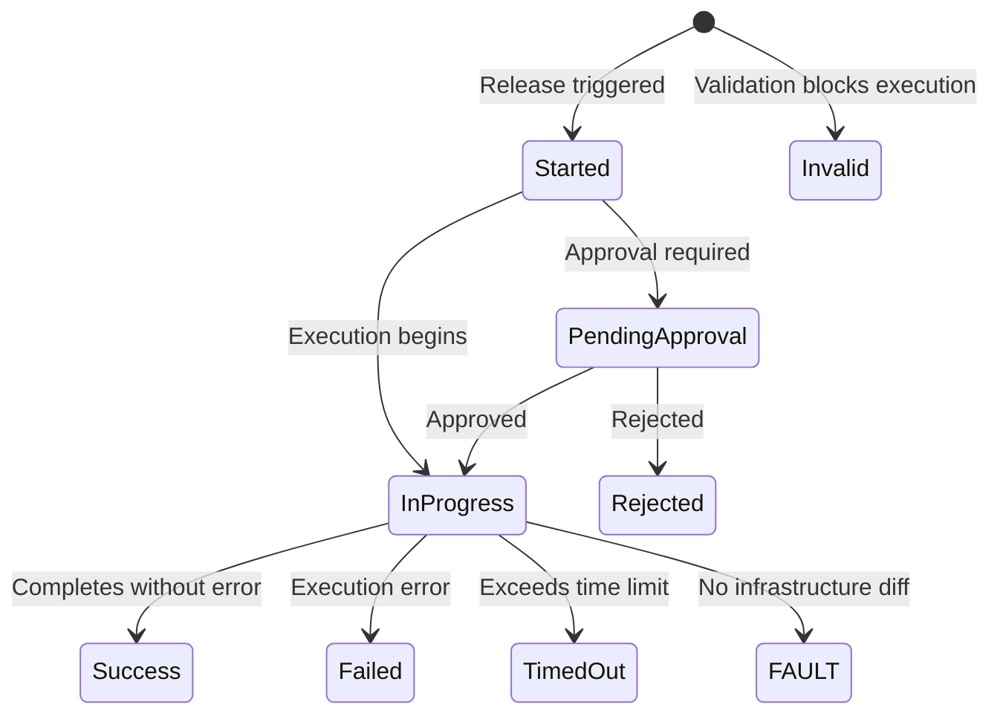

import StorylaneTour from '@site/src/components/StorylaneTour';

{/* <StorylaneTour id="abc123" /> */}

# Release History

The Release History table on the Environment Releases page lists every release that has run for an environment. Use it to monitor outcomes, investigate failures, apply planned changes, manage labels, and retry or repeat releases.

The page auto-refreshes every 30 seconds, so in-progress release status updates without manual reload. History is paginated at 25 entries per page with server-side pagination.

## Viewing release history

The **Release History** table shows one release per row. You can search and filter across multiple columns to narrow the list.

| Column | Description |
|---|---|
| **Started** | Timestamp when the release began. Supports inline keyword search. |
| **Status** | Current or final status of the release. Supports dropdown filter. |
| **IaC Version** | The Infrastructure-as-Code version used. Supports inline keyword search. |
| **Last Commit** | The last commit reference associated with the release. |
| **Release Type** | The release type (Full, Selective, Custom, etc.). Supports dropdown filter. |

### Filtering and searching

- Filter by **Status** using the dropdown on the **Status** column. Available values: **Success**, **Failed**, **In Progress**, **Started**, **Pending Approval**, **Rejected**, **Timed Out**, **Invalid**.
- Filter by **Release Type** using the dropdown on the **Release Type** column.
- Search by start time using the inline search on the **Started** column.
- Search by IaC version using the inline search on the **IaC Version** column.
- Use the **Show no changes** toggle to include or exclude releases recorded with status FAULT. FAULT means Terraform found no infrastructure diff — it is not a failure.

## Release statuses

| Status | Meaning |
|---|---|
| **Success** | Release completed without errors. |
| **Failed** | Release failed during execution. Error details are shown in the Release Details drawer. |
| **In Progress** | Release is currently running. |
| **Started** | Release has been initiated and is preparing to run. |
| **Pending Approval** | Release is waiting for an approver to approve or reject it. |
| **Rejected** | Release was rejected by an approver and did not execute. |
| **Timed Out** | Release exceeded the allowed time limit. |
| **Invalid** | Release was rejected before execution due to validation failures. Click the **Invalid** tag in the history row to view validation error details. |
| **FAULT** | Terraform found no infrastructure diff. Not a failure. Hidden by default — use the **Show no changes** toggle to include these entries. |

*Figure: Possible states of a release from trigger to final outcome*

## Release Details

Click any row in the history table to open the **Release Details** drawer for that release.

The drawer contains the following sections:

1. **Deployment Information** — who triggered the release, start time, duration, IaC version, release type, and current status.
2. **Terraform Changes** — resources added, changed, or destroyed during the release.
3. **App Deployments** — application deployments triggered as part of the release.
4. **Migration Scripts** — migration scripts executed during the release.
5. **Build Steps** — build steps run as part of the release.
6. **Error Details** — error messages when a release has failed.

To view the complete Terraform output for a release, click **View Terraform Logs** in the drawer.

## Retry and repeat

From the **Release Details** drawer:

- **Retry** — available on a failed release. Re-runs the same release configuration.
- **Repeat** — available on a successful release. Triggers a new release using the same configuration.

## Applying a planned release

After a Plan release (Full Plan, Selective Plan, or Rollback Plan) succeeds, the corresponding apply action appears inside its **Release Details** drawer.

- Click **Apply Full Plan** to apply the changes from a Full Plan release.
- Click **Apply Selective Plan** to apply the changes from a Selective Plan release.
- Click **Apply Rollback Plan** to apply the rollback from a Rollback Plan release.

> **Note:** Apply actions only appear after the associated plan release has completed successfully.

## Release Labels

Labels are custom tags you attach to individual release history entries for classification or tracking. They do not affect release execution.

:::info Interactive Demo
*An interactive walkthrough for this flow will be added here.*
:::

**To attach an existing label to a release:**

1. Click the release row to open the **Release Details** drawer.
2. Select the label from the label list in the drawer.

**To create a new label:**

1. Click the release row to open the **Release Details** drawer.
2. Type the new label name inline in the labels field.
3. Confirm creation.

**To remove a label from a release:**

1. Click the release row to open the **Release Details** drawer.
2. Remove the label from the labels attached to that entry.

> **Note:** Labels are managed per release entry. Removing a label from one release does not affect other releases.

> **Tip:** You can also manage releases programmatically. See the [API Reference](https://apidocs.facets.cloud) for details.

## Related Topics

- [Releases Overview](./overview.mdx) - What releases are and how they work
- [Performing Releases](./performing-releases.mdx) - How to trigger any release type
- [Release Approval Workflow](./approval-workflow.mdx) - Approving, rejecting, and signing off on releases
