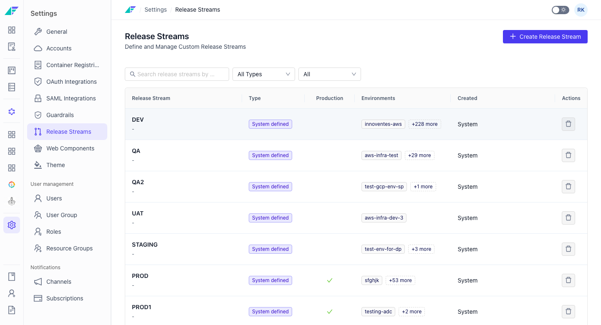

# Release Streams

Release Streams are named pipelines that categorize how releases flow through environments in your organization. They are configured at the organization level and are then associated with environments to control promotion and deployment routing.

Release Streams are managed at **Settings > Release Streams**. System-defined streams exist by default and cannot be deleted. Users with the appropriate permission can create and manage custom release streams.

## Viewing Release Streams

The Release Streams table lists all streams — both system-defined and custom — with the following columns:

| Column | Description |
|---|---|
| **Release Stream** | The name of the release stream |
| **Type** | Whether the stream is system-defined or custom |
| **Production** | Indicates whether the stream is marked as a production stream |
| **Environments** | Environments currently associated with this stream |
| **Created** | When and by whom the stream was created |

## Creating a Release Stream

:::info Interactive Demo
*An interactive walkthrough for this flow will be added here.*
:::

1. Navigate to **Settings > Release Streams**.
2. Click **Create Release Stream**.
3. Fill in the form:
   - **Release Stream Name** — required. Must be 2–10 characters with no leading or trailing whitespace.
   - **Description** — optional. A short description of the stream's purpose.
   - **Production** — optional toggle, default off. Enable this to mark the stream as a production stream.
4. Click **Create** to save the release stream.

> **Note:** Release stream names must be unique within the organization. Submitting a duplicate name returns an error — choose a different name and try again.

> **Note:** You need the `RELEASE_STREAM_WRITE` permission to create a release stream.

## Deleting a Release Stream

Click the delete action on a custom release stream row to remove it.

> **Warning:** Deleting a release stream is permanent. Associated environments may need to be reassigned to a different stream after deletion.

System-defined release streams cannot be deleted. Their delete action is disabled with the tooltip "System defined release streams cannot be deleted."

You need the `RELEASE_STREAM_DELETE` permission to delete a release stream.

## Permissions

| Permission | Action |
|---|---|
| `RELEASE_STREAM_WRITE` | Create a release stream |
| `RELEASE_STREAM_DELETE` | Delete a release stream |

> **Tip:** You can also manage release streams programmatically. See the [API Reference](https://apidocs.facets.cloud) for details.

## Troubleshooting

| Problem | Solution |
|---|---|
| Error when creating a stream | A stream with that name already exists. Choose a unique name. |
| Delete button is disabled | The stream is system-defined and cannot be deleted. |

## Related Topics

- [Releases Overview](./overview.md) - How releases work in Facets
- Delivery Pipeline - How environments are ordered for release promotion
