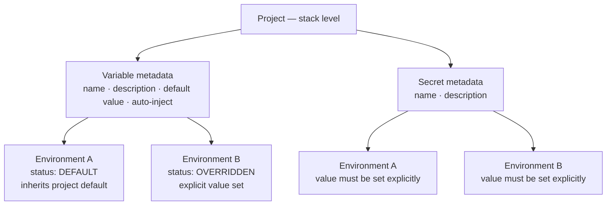

Secrets and Variables give you a single place to define named configuration values for a project. You define the name and type once at the project level, then set the actual value independently for each environment. Resources reference values by name rather than embedding raw values in their configuration.

## What are Secrets and Variables?

Both types are named values that live at the project level and resolve per environment. They differ in sensitivity and behaviour:

| | Variables | Secrets |
|---|---|---|
| Stores sensitive values | No | Yes |
| Project-level default | Supported | Not supported — must be set per environment |
| Masked in the UI | No | Yes — displayed as `****` until revealed |
| Auto-Inject support | Yes | No |

**Variables** hold non-sensitive values such as feature flags, service tiers, or endpoint names. You can set a project-level default that all environments inherit, then override only the environments that differ.

**Secrets** hold sensitive values such as passwords, API keys, and tokens. Because there is no project-level default, each environment must have the value set explicitly before the secret can be used.

Both types are managed from the **Secrets & Variables** page inside a project.

## How values are scoped

*Figure: Variable and secret metadata is defined at the project level; values are stored and tracked per environment with a DEFAULT or OVERRIDDEN status*

## Reference expressions

Resources refer to project-level values using reference expressions. The platform resolves the expression to the actual environment value at runtime.

| Type | Expression pattern |
|---|---|
| Variable | `${blueprint.self.variables.VARIABLE_NAME}` |
| Secret | `${blueprint.self.secrets.SECRET_NAME}` |

These expressions are used in two ways:

- **Autocomplete fields in resource configuration** — when a configuration field supports a variable or secret reference, you can type or select the name and the field is populated with the correct expression automatically.
- **Resource environment variable entries** — when adding an environment variable to a resource, you can choose a project secret or project variable as the value source, which sets the field to the appropriate expression.

You can also copy an expression directly from the **Secrets & Variables** page using the **Copy $ Reference** action on any row, then paste it into any configuration field that accepts free text.

## Secrets storage

Secret values are stored in an external secrets manager. The platform supports multiple storage backends and abstracts the active one — you interact with secrets the same way regardless of which backend your deployment uses. Secret values are never stored in plain text within the platform database.

## Auto-Inject

Auto-Inject is available for Variables only. When you enable **Inject in all resources** on a variable, the platform injects it into every resource in the project at runtime. You do not need to add an explicit reference in each resource's configuration.

Use Auto-Inject only for variables that every resource genuinely needs. Injecting variables that only a subset of resources requires adds noise to those resources' runtime environments.

> **Note:** Auto-Inject is not available for Secrets.

> **Tip:** You can also manage secrets and variables programmatically. See the [API Reference](https://apidocs.facets.cloud) for details.

## Related Topics

- [Project Level Secrets and Variables](./project-level-secrets.md) — create, edit, delete, and set per-environment values
- [Resource Variables](./resource-variables.md) — manage environment variables at the individual resource level
- [Resource Connections](./resource-connections.md) — use secret and variable references in resource configuration fields
