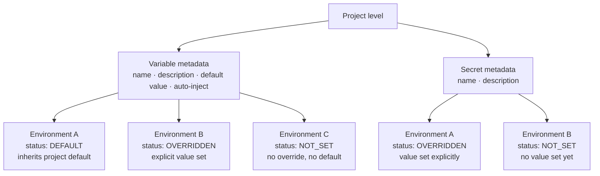

import StorylaneTour from '@site/src/components/StorylaneTour';

{/* <StorylaneTour id="abc123" /> */}

Secrets and Variables give you a single place to define named configuration values for a project. Define the name and type once at the project level, then set the actual value independently for each environment. Resources reference values by name using expressions rather than embedding raw values in their configuration.

Both types live on the **Secrets & Variables** page inside a project.

## What are Secrets and Variables?

Both types are named values defined at the project level and resolved per environment. They differ in sensitivity and behaviour:

| | Variables | Secrets |
|---|---|---|
| Stores sensitive values | No | Yes |
| Project-level default | Supported | Not supported — must be set per environment |
| Masked in the UI | No | Yes — displayed as `****` until revealed |
| Auto-Inject support | Yes | No (N/A) |

**Variables** hold non-sensitive values such as hostnames, ports, feature flags, and connection strings. You can set a project-level default that all environments inherit, then override only the environments that differ.

**Secrets** hold sensitive values such as API keys, tokens, and certificates. Because there is no project-level default, each environment must have the value set explicitly before the secret can be used. Secret values are never shown in plain text in the main table.

**Required variables:** A variable is required when it has no default value set at the project level. Required variables with no environment override display as **N/A** in red in the environment comparison view. Secrets are always required per environment.

## How values are scoped

Metadata for each entry — name, description, default value, and the auto-inject flag — is defined once at the project level. The actual value for each environment is stored and tracked separately, and carries a status:

| Status | Meaning |
|---|---|
| DEFAULT | The environment inherits the project-level default value |
| OVERRIDDEN | An explicit value has been set for this environment |
| NOT_SET | No environment override exists and no project-level default is set |
| NO_ACCESS | You do not have permission to view this environment's value |

*Figure: Variable and secret metadata is defined at the project level; values are tracked per environment with a status of DEFAULT, OVERRIDDEN, NOT_SET, or NO_ACCESS*

## Reference expressions

Resources refer to project-level values using reference expressions. The platform resolves each expression to the actual environment value at runtime.

| Type | Expression pattern |
|---|---|
| Variable | `${blueprint.self.variables.VARIABLE_NAME}` |
| Secret | `${blueprint.self.secrets.SECRET_NAME}` |

There are two ways to use these expressions:

- **Autocomplete fields in resource configuration** — configuration fields that support a variable or secret reference let you type or select the name; the field is populated with the correct expression automatically.
- **Copy $ Reference** — click **Copy $ Reference** on any row of the **Secrets & Variables** page to copy the expression to your clipboard, then paste it into any configuration field that accepts it.

The platform resolves the expression at runtime. For variables, it uses the environment-specific override if one exists, and falls back to the project-level default otherwise. For secrets, a value must be set at the environment level — there is no fallback default.

## Auto-Inject

Auto-Inject is available for Variables only. When you enable **Inject in all resources** on a variable, the platform injects it into every resource in the project at runtime without requiring an explicit reference in each resource's configuration.

Use Auto-Inject only for variables that every resource genuinely needs. Injecting variables that only some resources require adds unnecessary values to other resources' runtime environments.

> **Note:** Auto-Inject is not available for Secrets. The **Auto-Inject** column shows **N/A** for all secret rows.

## Secrets storage

Secret values are stored in an external secrets manager — either AWS Secrets Manager or OpenBao/HashiCorp Vault, depending on your deployment. The platform abstracts the active backend: you interact with secrets the same way regardless of which backend is in use.

Secret values are never stored in plain text within the platform database. Values are fetched on demand only when you explicitly reveal or bulk-edit them in the environment overrides drawer.

## Audit logging

All create and update operations on secrets and variables are audit-logged. Use the audit log to trace who changed a value and when.

> **Tip:** You can also manage secrets and variables programmatically. See the [API Reference](https://apidocs.facets.cloud) for details.

## Environment-level view

You can view the **Secrets & Variables** page in the context of a specific environment. When scoped to an environment, the page heading changes to **Secrets & Variables - [environment name]**. In this view, the **Define New** button is disabled — new variable and secret definitions can only be added at the project level.

## Related Topics

- [Project Level Secrets and Variables](./project-level-secrets.md) — create, edit, delete, and set per-environment values
- [Resource Variables](./resource-variables.md) — manage environment variables at the individual resource level
- [Resource Connections](./resource-connections.md) — use secret and variable references in resource configuration fields
