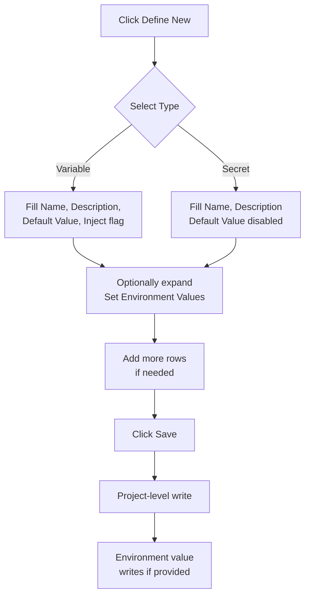

import StorylaneTour from '@site/src/components/StorylaneTour';

{/* <StorylaneTour id="abc123" /> */}

# Project Level Secrets and Variables

All operations to create, view, edit, and delete secrets and variables are performed from the **Secrets & Variables** page within a project. The page displays all entries defined for the project.

When you view this page scoped to a specific environment, the page header changes to **Secrets & Variables - [environment name]**. In this environment-level view, the **Define New** button is disabled with a tooltip explaining that definitions can only be added at the project level.

## Prerequisites

- You have access to the project where you want to manage secrets and variables.
- To create, edit, or delete entries, you need the `STACK_WRITE` permission on the project.
- To set environment-specific values, you also need the `ENVIRONMENT_CONFIGURE` permission on each target environment.

---

## View secrets and variables

The **Secrets & Variables** page displays all entries for the project in a table with the following columns:

| Column | Description |
|---|---|
| **Name** | The unique identifier for the secret or variable |
| **Default Value** | The project-level default (Variables only); shown as `N/A` for Secrets |
| **Auto-Inject** | Whether the variable is automatically injected into all resources; shown as `N/A` for Secrets |
| **Used By** | Badges showing each resource that references this entry |

Use the filter options — **All Types**, **Variables Only**, or **Secrets Only** — to narrow the list. Use **Search Secrets & Variables...** to find entries by name.

Secret values display as `****` by default in all views.

### Compare environments side by side

Use the **Compare Environments** multi-select dropdown to add one or more environment columns to the table. Each column shows the value for that environment and its status.

Enable the **Show Secrets** toggle to reveal secret values in the comparison view. This requires the `ENVIRONMENT_CONFIGURE` permission.

---

## Define a new secret or variable

:::info Interactive Demo
*An interactive walkthrough for this flow will be added here.*
:::

The **Add Secrets/Variables** drawer lets you create one or more entries in a single submission.


*Figure: Create flow — type selection determines which fields are available; setting environment values at creation time is optional*

1. On the **Secrets & Variables** page, click **Define New**.
2. The **Add Secrets/Variables** drawer opens.
3. For each entry, fill in the fields:

   | Field | Description |
   |---|---|
   | **Type** | Select **Secret** or **Variable** |
   | **Name** | Must start with a letter or underscore; only letters, numbers, and underscores allowed |
   | **Description** | Optional. A short note about the entry's purpose |
   | **Default Value** | Available for Variables only. For Secrets, this field is disabled — secret values must be set per environment |
   | **Inject in all resources** | Checkbox available for Variables only. When enabled, the variable is injected into all resources at runtime without an explicit reference |

4. To add more entries in the same submission, add additional rows to the form.
5. To set per-environment values at creation time, expand the **Set Environment Values** section.
6. Click **Save**.

> **Note:** Names must be unique within the project. Names within a single bulk request must also be unique.

> **Tip:** You can also perform this operation programmatically. See the [API Reference](https://apidocs.facets.cloud) for details.

---

## Edit an existing secret or variable

:::info Interactive Demo
*An interactive walkthrough for this flow will be added here.*
:::

Click **Edit** on any row to open the edit drawer. You can update the description, default value (Variables only), the **Inject in all resources** flag, or per-environment values. Only changed environment values are submitted when you save.

---

## Set environment-specific values

:::info Interactive Demo
*An interactive walkthrough for this flow will be added here.*
:::

Use the Environment Overrides drawer to set or update values for a specific environment.

1. On the **Secrets & Variables** page, click **Edit Env. Values** for the environment you want to configure.
2. The Environment Overrides drawer opens, showing all variables and secrets for that environment.
3. The **Status** column shows the current state for each entry:

   | Status | Meaning |
   |---|---|
   | **DEFAULT** | The environment inherits the project-level default value |
   | **OVERRIDDEN** | An explicit value has been set for this environment |
   | **NOT_SET** | No environment override exists and no project-level default is set |
   | **NO_ACCESS** | You do not have permission to view this environment's value |

4. Choose how to enter values:
   - **Inline editing** — edit each row directly in the table.
   - **Bulk JSON editor** — switch to the JSON editor to edit all values at once. The editor exposes a two-key structure:
     ```json
     {
       "secrets": { "SECRET_NAME": "value" },
       "variables": { "VARIABLE_NAME": "value" }
     }
     ```
     Changes in the JSON editor are applied to in-memory state. You must click **Save** to persist them. JSON syntax errors are shown inline before saving is allowed.
5. For secrets: values are masked by default. Use the reveal toggle on a row to view the current value. A single batch call fetches all secret values for the environment when you first reveal a secret — subsequent reveals within the same drawer session do not make additional API calls.
6. Click **Save** to apply the changes. A success toast appears. If the environment is in a releasable state and you have the `ENVIRONMENT_CONFIGURE` permission, the toast includes a **Release Now** shortcut.

---

## Copy a reference expression

Click **Copy $ Reference** on any row to copy the formatted reference expression to the clipboard. Paste the expression into any resource configuration field that accepts it.

| Type | Expression |
|---|---|
| Variable | `${blueprint.self.variables.VARIABLE_NAME}` |
| Secret | `${blueprint.self.secrets.SECRET_NAME}` |

See [Resource Connections](./resource-connections.md) for how these expressions are used in resource configuration fields.

---

## Delete a secret or variable

Click **Delete** on a row. A confirmation dialog appears.

> **Warning:** Deletion removes the entry from all environments and cannot be undone.

If any resources reference the entry, the **Delete** button is disabled and shows a tooltip: `"Cannot delete: '[name]' is being used by [N] resource(s)"`. Remove all resource references first, then delete.

---

## Permissions

| Action | Required permission |
|---|---|
| View secrets and variables | Stack read |
| Define new / Edit / Delete | `STACK_WRITE` |
| Set environment-specific values | `STACK_WRITE` + `ENVIRONMENT_CONFIGURE` on each target environment |
| Reveal or bulk-edit secrets in the environment overrides drawer | `ENVIRONMENT_CONFIGURE` |

When `STACK_WRITE` is missing, the **Define New** and **Edit Env. Values** buttons are disabled, and edit and delete row actions are hidden.

If `ENVIRONMENT_CONFIGURE` is missing for any environment in a batch save, the entire save operation is rejected.

Environments you cannot access are excluded from the response entirely — they are not shown with masked values.

---

## Troubleshooting

| Problem | Message | Solution |
|---|---|---|
| Name already exists in the project | `"Variable '[name]' already exists in stack '[stackName]'"` (HTTP 400) | Choose a unique name |
| Duplicate names in a single bulk request | `"Duplicate variable names found in request"` (HTTP 400) | Ensure all names in the batch are unique |
| Variable not found on update | `"Variable '[name]' not found in stack '[stackName]'"` (HTTP 404) | Refresh the page and retry |
| Missing environment configure permission | `"You do not have permission to add/update variables to these environments"` (HTTP 403) | Contact your project admin |
| Page fails to load | `"Failed to load variables"` | Check permissions or reload the page |
| Environment values fail to load | `"Failed to load environment variables"` | Check permissions or reload |
| Secret value fails to load | `"Failed to load secret value"` / `"Failed to load secret values for bulk edit"` | Check secrets manager connectivity |
| Name format invalid | Form error | Names must start with a letter or underscore; use only letters, digits, and underscores |
| Bulk JSON editor blocks save | Inline JSON error | Fix JSON syntax errors before saving |

---

## Best practices

- Store all sensitive values (passwords, API keys, tokens) as Secrets, not Variables.
- Enable **Inject in all resources** only for variables that every resource genuinely needs.
- Set a project-level default for variables that apply to most environments; override only where needed.
- Use the bulk JSON editor when setting many environment values at once.
- Check the **Used By** column before deleting — deletion is blocked while any resource references the entry.
- All create and update operations are audit-logged. Use the audit log to trace changes.

---

## Related Topics

- [Secrets and Variables](./overview.md) - Overview of secrets and variables in Facets
- [Resource Variables](./resource-variables.md) - Environment variable configuration for individual resources
- [Resource Connections](./resource-connections.md) - How to use reference expressions in resource configuration
