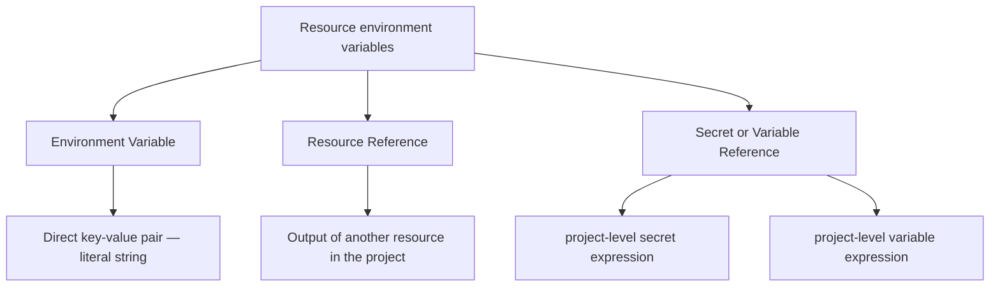

Resource variables are environment variable configurations defined at the individual resource level. They control which values are injected into a resource at runtime. This is separate from project-level secrets and variables — it is the resource-specific mapping of names to values or references, managed from the resource configuration UI.

## Types of resource environment variable values

A resource's environment variable configuration supports three value types.

*Figure: The three value types available in a resource's environment variable configuration*

| Type | What it holds |
|---|---|
| **Environment Variable** | A direct key-value pair. The value is a literal string you enter when adding the entry. |
| **Resource Reference** | A reference to an output exported by another resource in the same project. |
| **Secret or Variable Reference** | A reference to a project-level secret or variable, expressed as `${blueprint.self.secrets.SECRET_NAME}` or `${blueprint.self.variables.VARIABLE_NAME}`. |

The **Type** field in the add modal determines which input mode is shown. Select **Environment Variable** for a literal value or **Resource Reference** to reference another resource's output. For project secrets and variables, select the appropriate type and use the autocomplete field to pick by name — the expression is formatted automatically.

## Add a resource environment variable

:::info Interactive Demo
*An interactive walkthrough for this flow will be added here.*
:::

> **Tip:** You can also perform this operation programmatically. See the [API Reference](https://apidocs.facets.cloud) for details.

**Requires:** `RESOURCE_WRITE` permission.

1. Open the resource configuration for the resource you want to configure.
2. Navigate to the **Environment Variables** panel.
3. Click the add action to open the add variable modal.
4. In the **Type** field, select the value type:
   - **Environment Variable** — for a direct key-value pair.
   - **Resource Reference** — to reference the output of another resource.
   - For a project secret or variable, select the corresponding type and use the autocomplete field to search and select by name.
5. Enter the key name.
6. Enter or select the value:
   - For **Environment Variable**, enter the literal string value.
   - For **Resource Reference**, select the resource and output field.
   - For a secret or variable reference, the autocomplete populates the expression automatically.
7. Save the change. The new entry appears in the **Environment Variables** panel.

## Edit and delete resource environment variables

Existing entries in the **Environment Variables** panel can be edited or removed. Both operations require the `RESOURCE_WRITE` permission.

> **Warning:** Removing an entry from a resource's environment variable configuration takes effect at the next deployment. The value will no longer be injected into that resource.

## Auto-Inject variables

Variables with **Auto-Inject** enabled at the project level are injected into all resources automatically. They do not appear as explicit entries in the **Environment Variables** panel, but they are present in the resource at runtime.

You do not need to add an **Auto-Inject** variable manually through the panel. To configure the **Auto-Inject** flag on a variable, see [Project Level Secrets and Variables](./project-level-secrets.md).

> **Note:** Auto-Inject is available only for Variables, not Secrets.

## Permissions

| Action | Required permission |
|---|---|
| Add or edit resource environment variables | `RESOURCE_WRITE` |

## Related Topics

- [Secrets and Variables](./overview.md) — Overview of secrets and variables in the platform
- [Project Level Secrets and Variables](./project-level-secrets.md) — Define and manage secrets and variables at the project level
- [Resource Connections](./resource-connections.md) — How to use secret and variable references in resource configuration fields
