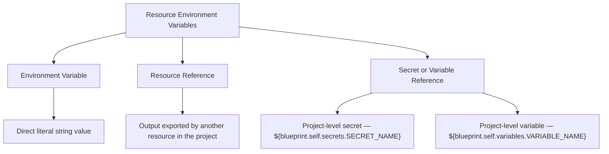

import StorylaneTour from '@site/src/components/StorylaneTour';

{/* <StorylaneTour id="abc123" /> */}

Resource variables are environment variable configurations defined at the individual resource level. They control which values are injected into a resource at runtime.

Resource variables are distinct from project-level secrets and variables. Project-level entries define a name, type, and optional default once for the whole project. Resource variables are the per-resource mapping layer — they specify which key names map to which values or references for a particular resource.

## Types of resource environment variable values

*Figure: The three types of value a resource environment variable can hold*

| Type | What it holds |
|---|---|
| **Environment Variable** | A direct key-value pair with a literal string entered at configuration time |
| **Resource Reference** | A reference to an output exported by another resource in the same project |
| **Secret or Variable Reference** | A reference to a project-level secret or variable using the `${blueprint.self.secrets.SECRET_NAME}` or `${blueprint.self.variables.VARIABLE_NAME}` expression; autocomplete fields surface available project entries by name |

## Add a resource environment variable

:::info Interactive Demo
*An interactive walkthrough for this flow will be added here.*
:::

**Requires:** `RESOURCE_WRITE` permission.

1. Open the resource configuration.
2. Navigate to the **Environment Variables** panel.
3. Click the add action.
4. Select the **Type**:
   - For **Environment Variable**: enter a key name and a literal string value.
   - For **Resource Reference**: enter a key name and select the source resource and the output field to reference.
   - For a project secret or variable reference: enter a key name and use the autocomplete field to find and select the project-level entry. The field populates with the correct reference expression automatically.
5. Save the configuration.

> **Tip:** You can also perform this operation programmatically. See the [API Reference](https://apidocs.facets.cloud) for details.

## Edit and delete resource environment variables

**Edit:** Click the edit action on an existing entry. The same form opens pre-populated with the current values. Update any field and save. Requires `RESOURCE_WRITE` permission.

**Delete:** Remove the entry from the **Environment Variables** panel. Requires `RESOURCE_WRITE` permission.

> **Warning:** Removing a resource environment variable takes effect at the next deployment. The value will no longer be injected into that resource after the next release.

## Auto-Inject variables

Variables with Auto-Inject enabled at the project level are injected into all resources automatically. They do not appear as explicit entries in the **Environment Variables** panel, but they are present in the resource at runtime.

You do not need to add an Auto-Inject variable manually — it is already available to every resource without an explicit entry.

Auto-Inject is available only for Variables, not Secrets.

To configure the Auto-Inject flag on a variable, see [Project Level Secrets and Variables](./project-level-secrets.md).

## Permissions

| Action | Required permission |
|---|---|
| Add or edit resource environment variables | `RESOURCE_WRITE` |
| Delete a resource environment variable | `RESOURCE_WRITE` |

## Related Topics

- [Secrets and Variables](./overview.md) — Overview of project-level secrets and variables
- [Project Level Secrets and Variables](./project-level-secrets.md) — Define, edit, and set per-environment values
- [Resource Connections](./resource-connections.md) — Use secret and variable references in resource configuration fields
