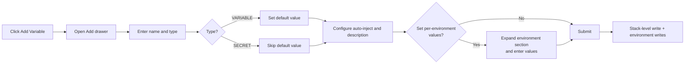
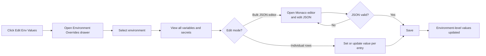
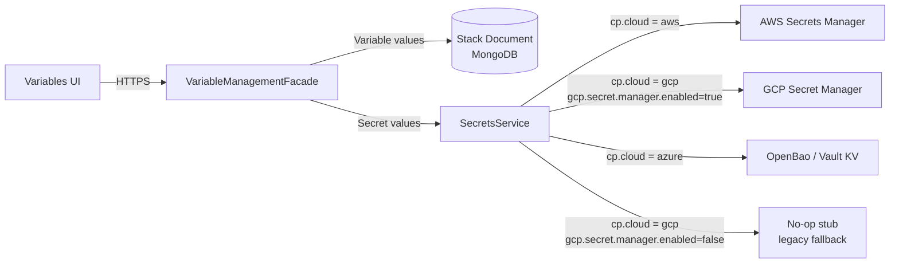

## Overview

Secrets and Variables are reusable named values defined at the project level and injected into resource configurations at runtime. They remove the need to hardcode environment-specific values inside resource blueprints and provide a single place to manage sensitive credentials and configuration data across all environments in a project.

Two entity types share the same Variables page:

- **VARIABLE** — has a project-level default value stored in the project document; the value is readable in plaintext in the UI.
- **SECRET** — value is stored exclusively in an external secrets manager (never in MongoDB); the value is masked in the UI by default.

Both types support a project-level default and per-environment overrides. The Variables page is accessible from the project sidebar navigation under the project (stack).

---

## The Variables Table

The Variables page displays a unified table of all variables and secrets defined in the project. Columns include: name, type (SECRET or VARIABLE), required status, default value, description, and auto-inject (global) flag.

Filter controls above the table let you filter by type (All / Secrets / Variables) and search by name. A **Show Secrets** toggle controls whether secret values are revealed in the environment columns across the table.

A variable is marked as **required** when its project-level default value is null. This status is computed dynamically — there is no separate required flag stored in the system.

---

## Add a Variable or Secret

*Figure: Flow for adding a variable or secret with optional per-environment values at creation time*

### Steps

1. From the project sidebar, navigate to **Variables**.
2. In the page header, click **Add Variable**.
3. In the drawer that opens, fill in the fields for each entry:
   - **Name** — must start with a letter or underscore; only letters, digits, and underscores are allowed. The pattern `^[a-zA-Z_]+[a-zA-Z0-9_]*$` is enforced client-side.
   - **Type** — select **VARIABLE** or **SECRET**.
   - **Description** (optional) — a human-readable label for the entry.
   - **Auto Inject** — check this box to automatically inject this value into all resources in the project without requiring an explicit reference in the resource configuration.
   - **Default Value** — appears only for VARIABLE type. Leave empty to mark the variable as required, forcing a per-environment value to be set before launch.
4. To set per-environment values at creation time, expand the **Per-Environment Values** section. A row appears for each environment in the project; enter values only where needed.
5. To add more entries in the same submission, add another entry to the batch.
6. Click **Save**. The system writes the definition to the stack document and stores any environment-specific values at the environment level.

> **Note:** Duplicate names within a project are rejected at the form level before submission. Name format is also validated client-side before the request is sent.

> **Tip:** You can also perform this operation programmatically. See the [API Reference](/api-reference) for details.

---

## Edit a Variable or Secret

Access the **Edit** row action from the Variables table. The Edit Variable drawer opens with the same fields as the Add drawer. You can update the name, type, global flag, description, default value, and per-environment values. The form calculates a diff and only sends changed environment values to the backend.

---

## Delete a Variable or Secret

Access the **Delete** row action from the Variables table.

> **Warning:** Deletion is permanent and cannot be undone. Before deleting, use the **View Usages** row action to confirm that no resource configurations reference the entry. Deletion is blocked if any blueprint file references the variable or secret — the error message lists the referencing resources. Remove all references in resource configurations before retrying the delete.

---

## Environment Overrides

*Figure: Workflow for setting or updating per-environment variable and secret values*

### Steps

1. From the Variables page header, click **Edit Env Values**.
2. In the Environment Overrides drawer, select the target environment from the environment selector.
3. The drawer lists all variables and secrets for that environment. Each entry shows its current override status: **DEFAULT** (using the project-level default) or **OVERRIDDEN** (an environment-specific value is set).
4. Use the filter controls to narrow the list by type (All / Secrets / Variables) or override status (Overridden / Not Overridden).
5. To update individual entries, edit the value field inline for each row. Secret values are masked by default; click the reveal control on a row to fetch and display the current value from the external secrets manager.
6. To edit multiple entries at once, switch to **Bulk Edit** mode. A Monaco JSON editor opens showing all entries for the selected environment. Edit the JSON and confirm it is valid before saving — the editor blocks the save action if there are JSON syntax errors.
7. Click **Save** to write the environment-specific values.

> **Note:** Revealing a secret value triggers a fetch from the external secrets manager. The revealed value is cached in the component for the duration of the session. Avoid revealing secrets unnecessarily.

---

## Copy Reference and Use in Resource Configuration

Each row in the Variables table has a **Copy $ Reference** row action. Clicking it copies the interpolation reference string to the clipboard:

- For secrets: `${blueprint.self.secrets.SECRET_NAME}`
- For variables: `${blueprint.self.variables.VARIABLE_NAME}`

Paste this reference string into any resource configuration field. The platform resolves it to the actual value at runtime, pulling from the appropriate environment override or the project-level default.

### Using Autocomplete Widgets in Resource Forms

Within resource configuration forms, two autocomplete widgets surface project-level references automatically:

- **SecretRefWidget** — autocompletes to `${blueprint.self.secrets.NAME}` for secret-type entries.
- **VariableRefWidget** — autocompletes to `${blueprint.self.variables.NAME}` for variable-type entries.

When these widgets are available in a resource form field, you do not need to manually copy and paste references from the Variables table — the widget lists matching entries as you type.

---

## View Usages

Access the **View Usages** row action from the Variables table. A modal opens listing every resource that currently references the variable or secret in its configuration. Results are partitioned into project-level usages and per-environment usages.

Use this before editing a variable name or deleting an entry to understand the full impact across the project.

---

## Variables in the Launch Wizard

When launching an environment, the wizard includes a dedicated Variables step. The step displays all project variables in a table, allowing you to set or override per-environment values before the environment goes live.

Required variables — those with no project-level default value — are highlighted in the step, prompting you to provide a value before proceeding with the launch.

---

## Secret Storage Backends

*Figure: How variable and secret values are stored — variables go to MongoDB, secrets route to the appropriate external secrets manager based on cloud provider configuration*

Secret values are never stored in the project document in MongoDB. The platform selects the appropriate secrets backend at runtime based on the cloud provider configuration:

| Cloud Provider | Backend | Notes |
|---|---|---|
| AWS | AWS Secrets Manager | Default backend. Uses a Caffeine in-memory cache to reduce API calls. |
| GCP (Secret Manager enabled) | Google Cloud Secret Manager | Activated when `gcp.secret.manager.enabled=true`. Supports automatic or regional replication. |
| Azure | OpenBao (Vault-compatible KV) | Activated when `cp.cloud=azure`. Configurable path. Uses a Caffeine in-memory cache. |
| GCP (Secret Manager disabled) | No-op stub | Legacy fallback when `gcp.secret.manager.enabled=false`. Stores nothing — for GCP environments that have not yet enabled Secret Manager. |

Variable values (non-secret) are stored in the stack document in MongoDB at the project level. Per-environment overrides are stored separately at the environment level.

Both the AWS and OpenBao backends use a Caffeine in-memory cache on the control plane to reduce the number of round trips to the external secrets store.

---

## Permissions

| Operation | Required Permission |
|---|---|
| View variables and environment values | Stack read (`StackAllowedPermission`) |
| Add, edit, bulk add, delete variables | Stack write (`StackWritePermission`) |
| Set environment-specific values | Stack write + `ENVIRONMENT_CONFIGURE` for every target environment |
| Read environment values in API response | Access is filtered — only environments the user is allowed to access appear in the response |

When setting environment-specific values, the system checks that the user has `ENVIRONMENT_CONFIGURE` permission for every environment included in the request. If permission is missing for any environment, the entire request is denied with an access error.

When fetching values across environments, the response excludes environments the current user cannot access entirely — they do not appear in the response even with masked values.

---

## Troubleshooting

| Problem | Error | Resolution |
|---|---|---|
| Adding a variable with a name that already exists | HTTP 400: "Variable 'X' already exists in stack 'Y'" | Choose a unique name within the project. |
| Bulk add with duplicate names in the same request | HTTP 400: "Duplicate variable names found in request" | Ensure all names in the batch are unique before submitting. |
| Bulk add where some names already exist | HTTP 400 listing conflicting names | Remove or rename the conflicting entries from the batch. |
| Updating a variable that no longer exists | HTTP 404: "Variable 'X' not found in stack 'Y'" | Verify the variable name and confirm it has not been deleted. |
| Delete blocked by resource reference | Error listing referencing resources | Use View Usages to find all references, remove them from resource configurations, then retry the delete. |
| Write to environment denied | HTTP 403 AccessDeniedException | The user lacks `ENVIRONMENT_CONFIGURE` permission for one or more target environments. Contact a project admin. |
| Name rejected at form level | Form validation error | Use only letters, digits, and underscores. The name must start with a letter or underscore. |
| Bulk JSON editor blocks save | Inline JSON validation error | Fix all JSON syntax errors in the Monaco editor before saving. |

---

## Best Practices

- Use the **Auto Inject** flag only for values that every resource in the project genuinely needs. Overuse adds noise to all resource environments and makes it harder to trace where values come from.
- Leave the default value empty to mark a variable as required. This forces an explicit per-environment value to be set in the Launch Wizard before an environment goes live.
- Use the **View Usages** action before deleting a variable to identify all impacted resources in advance.
- Prefer the autocomplete widgets (SecretRefWidget, VariableRefWidget) in resource configuration forms over manually copying and pasting references — this reduces the risk of typos in interpolation strings.
- Secret values are revealed lazily in the Environment Overrides drawer. Each reveal triggers a fetch from the external secrets manager. Avoid revealing secrets unless you need to verify or update the value.
- All variable and secret create and update operations are recorded in the audit log. Use the audit log to trace who made changes and when.

---

## Related Topics

- [Resource Configuration](/resource-configuration) — How to use variable and secret references inside resource configuration forms and blueprint files.
- [Environment Management](/environment-management) — Managing environments within a project and configuring environment-level settings.
- [Launch Wizard](/launch-wizard) — The full environment launch workflow, including the Variables step where required values must be set before launch.
